# Blender Optics Simulator

[](https://github.com/emircbngl/blender-optics-simulator/actions/workflows/ci.yml)
[](LICENSE)

> *"See a need, fill a need."* — Bigweld, *Robots* (2005)

A Blender **4.2+ / 5.x** add-on for **designing, simulating, aligning, and rendering optical
setups** — lasers, mirrors, beam splitters, lenses, waveplates, polarizers, dichroics, gratings,
retroreflectors, isolators, cavities, deformable mirrors, wavefront sensors, and detectors — on
top of a real **optical-physics engine**: polarization (Jones/Stokes), interference (live
fringes), wavelength-selective optics, Gaussian-beam propagation, wavefront sensing & adaptive
optics, and analytic quantum readouts.

Everything is driven from **View3D ▸ Sidebar ▸ Optics**. An optional Python API (`optics_api`)
and a localhost **MCP bridge** let a script — or an AI agent (e.g. Claude via the Blender MCP) —
drive the same core headlessly.

<p align="center">
  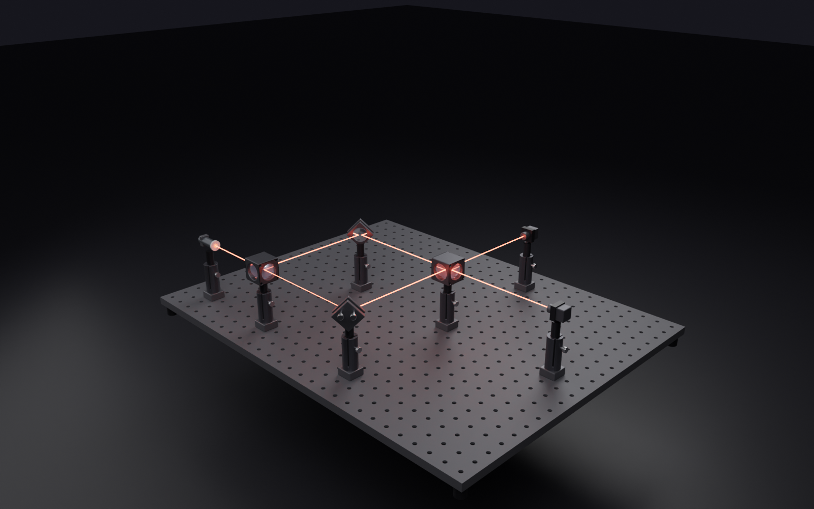
</p>

---

## Gallery

Everything below is produced by the add-on itself — a viewport beam trace baked to emission
tubes, the Scan + Plot operator, the Detector Fringe Image, and the live sensor window exported
to PNG. No external plotting or compositing.

| Interferogram | 2-D fringes (tilted) | Malus' law |
|:---:|:---:|:---:|
| 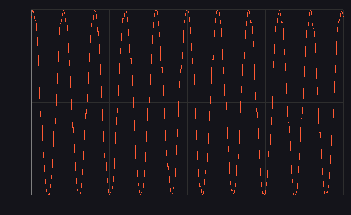 |  | 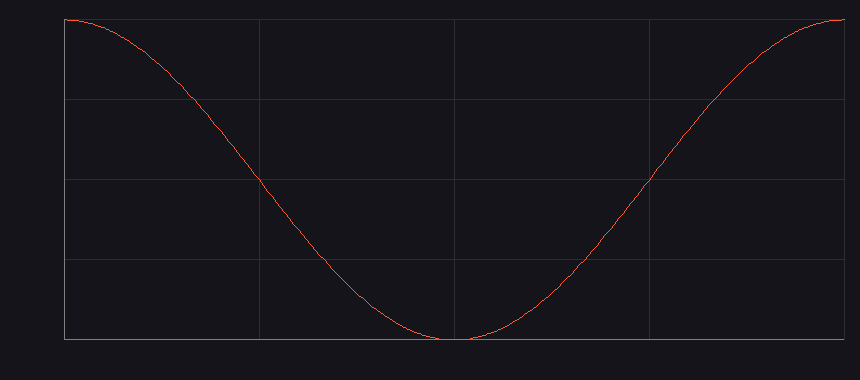 |
| Michelson intensity vs. optical path difference | straight fringes with the Gaussian-beam apodization envelope | polarizer transmission ∝ cos²θ |

| Newton's rings | Aberrated wavefront | Corrected wavefront |
|:---:|:---:|:---:|
| 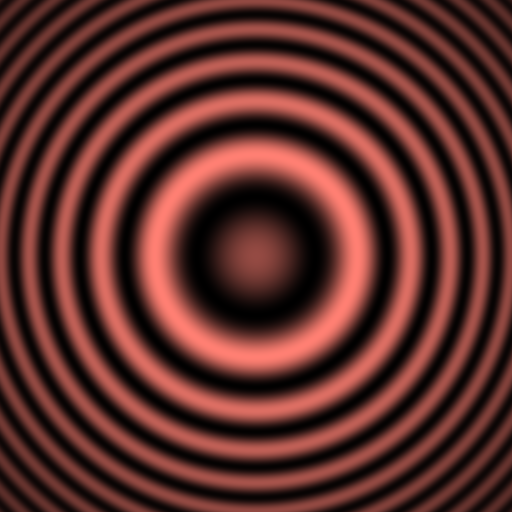 | 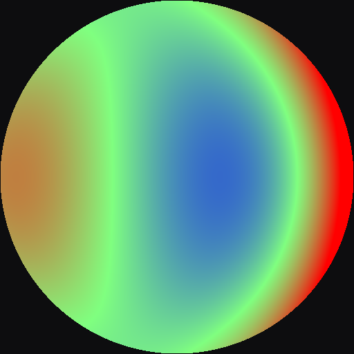 | 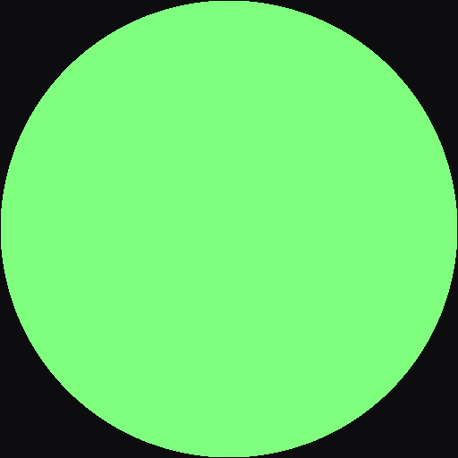 |
| a lens vs. a flat reference → concentric rings (the Gaussian-wavefront model) | adaptive-optics sensor: injected defocus + astigmatism + coma (RMS 0.56 λ) | after the closed loop → flat (RMS 0.00 λ) |

<p align="center">
  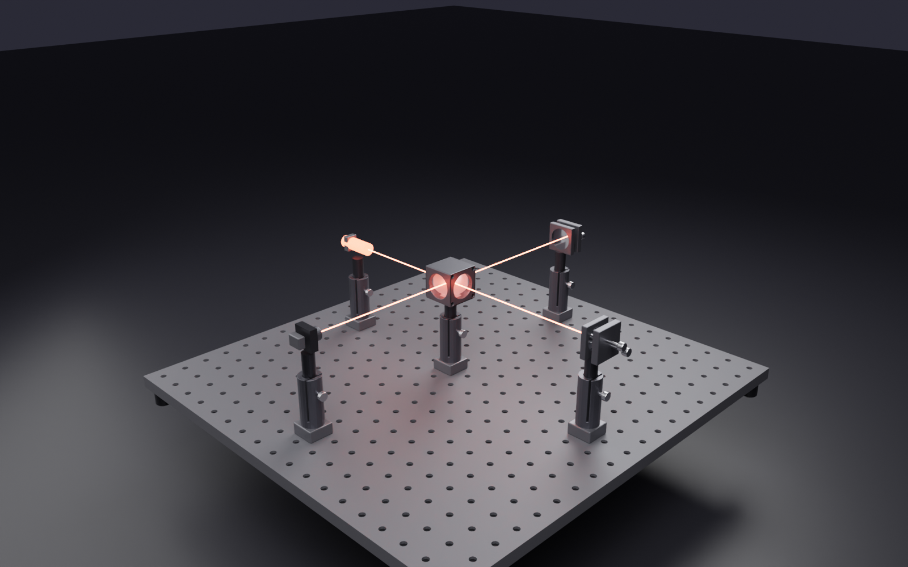
</p>

*One-click **Dress Bench** (Render panel) seats every optic at one **beam height** on a real
**tapped-hole breadboard** (metric 25 mm or imperial 1″, a scene setting), with **mount-type-correct
hardware** — kinematic mirror mounts (KM100/KS1-style, knurled adjusters), a cube beamsplitter
mount, threaded lens cells, rotation mounts for waveplates — on Ø12.7 mm posts in post-holders with
locking thumbscrews. Decoration only (never traced), so a Cycles render reads like a real optical
table. It is also a data model: `get_state()` reports the grid, the beam height, the vertical post
chain and which hole/system each optic uses, so an AI agent knows exactly where things go.*

| Cage system (16/30/60 mm) | Lens tube (SM05/SM1/SM2) | Dovetail rail + carriers |
|:---:|:---:|:---:|
| 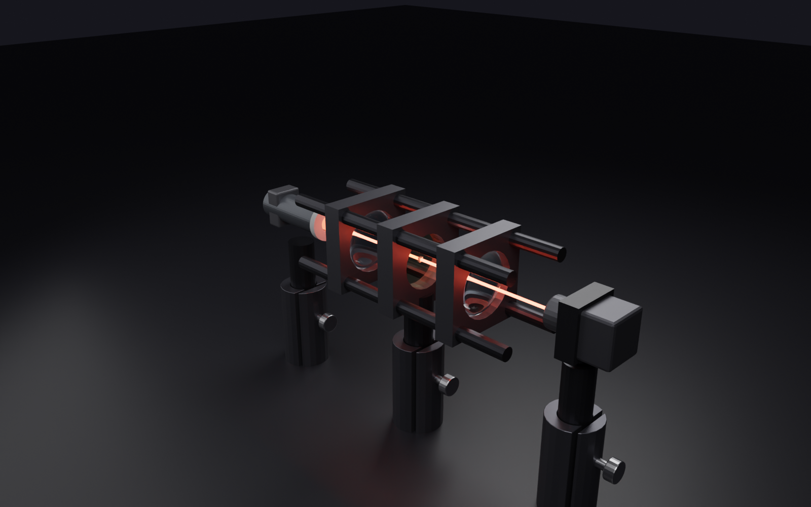 | 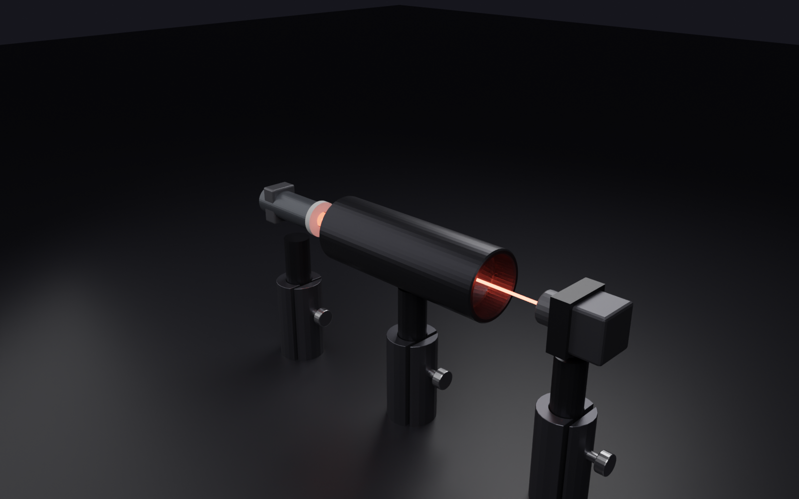 | 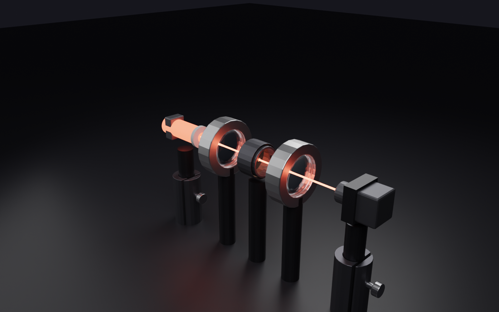 |
| collinear optics share 4 rods + one post (`make_cage`) | an in-line stack shares one barrel (`make_tube`) | carriers slide along one track (`make_rail` / `place_on_rail`) |

*Every mounting system is original GPL-clean procedural geometry built to the real functional
dimensions (Thorlabs SM threads, ER cage rods, RLA rail) — vendor CAD is never bundled. Grouping
optics into a cage/tube/rail never moves them, so the beam path is byte-identical.*

<p align="center">
  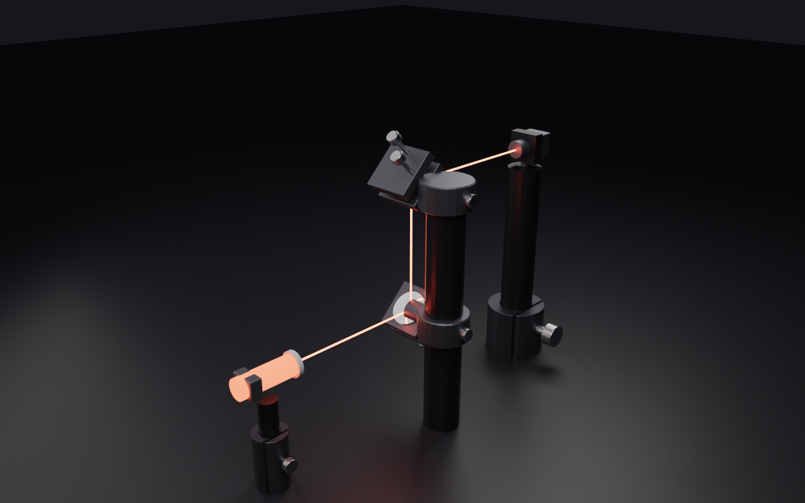
</p>

*A **periscope** raises the beam to a second height: two 45° fold mirrors share one Ø1″ post on 360°
post-clamp collars (the real **RS99** assembly), and the beam runs up beside the post in clear air. A
geometric **validator** guarantees no support post ever sits in a beam path.*

### Complete systems

The same primitives compose into entire subsystems — each a one-line
`build_example('cage_system' | 'tube_system' | 'rail_system' | 'hybrid_system')`, fully agent-drivable:

| Full 30 mm cage relay | SM1 lens-tube 4f → camera | Dovetail-rail beam expander |
|:---:|:---:|:---:|
| 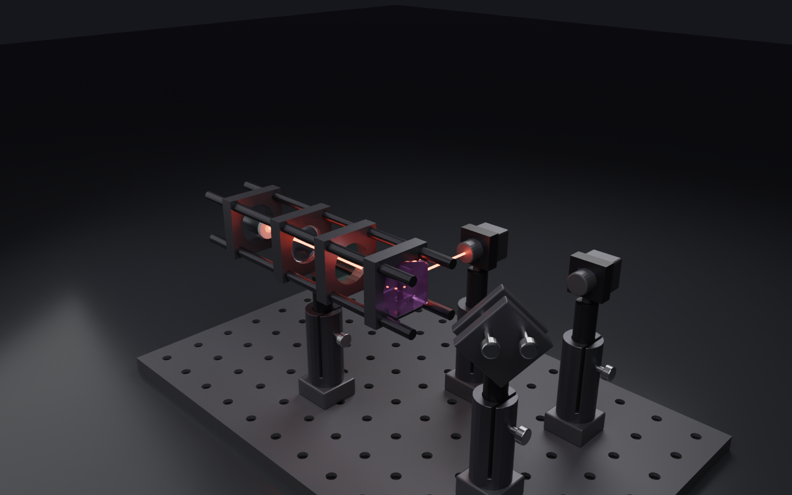 | 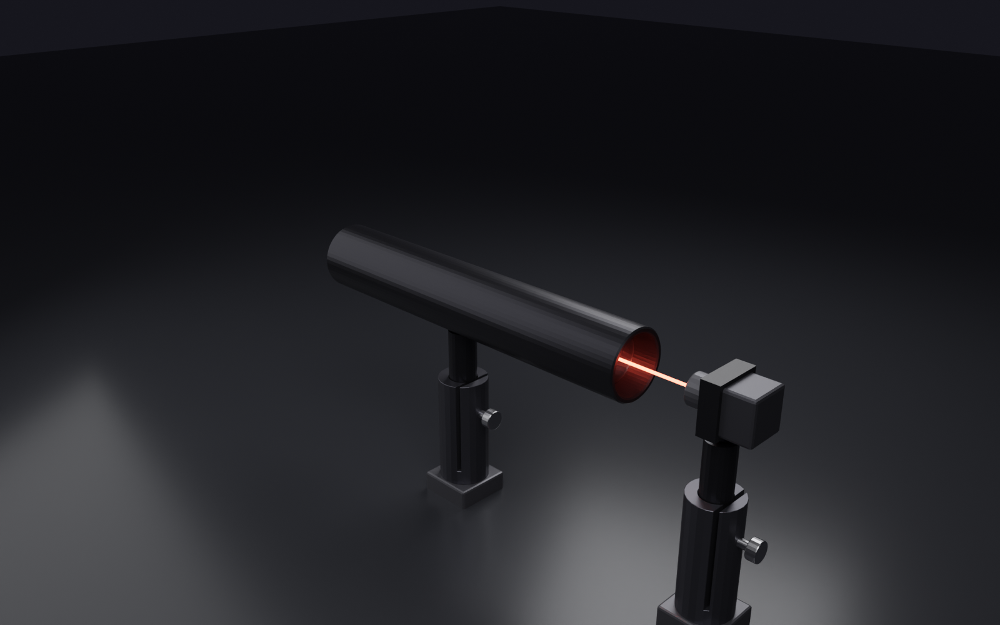 | 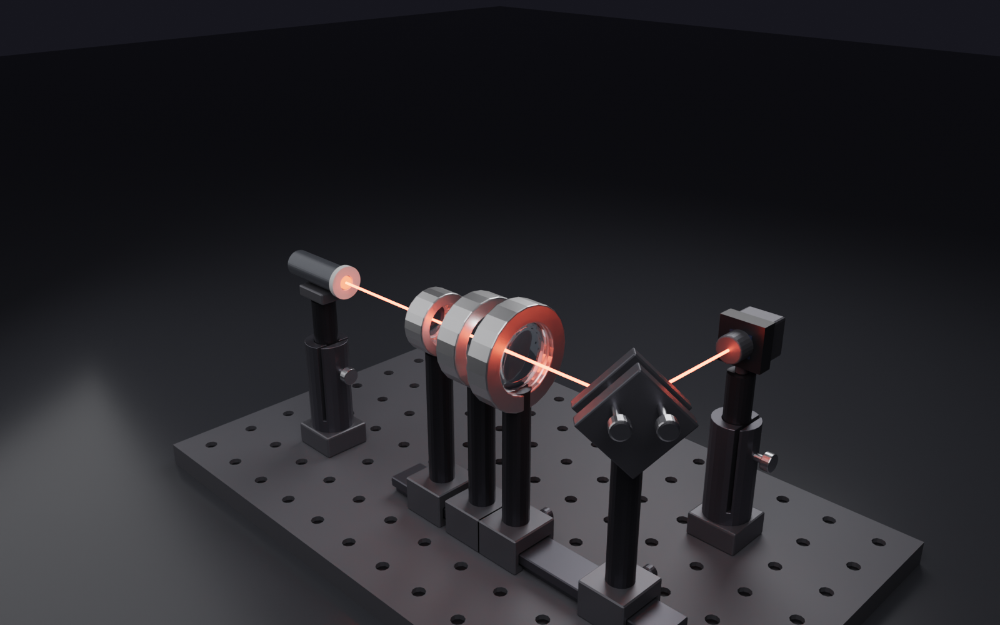 |
| fibre → collimator → polarizer → PBS share 4 rods + one post | a fibre + two relay lenses share one Ø1.2″ barrel | a Galilean expander + iris + fold ride carriers on one rail |

<p align="center">
  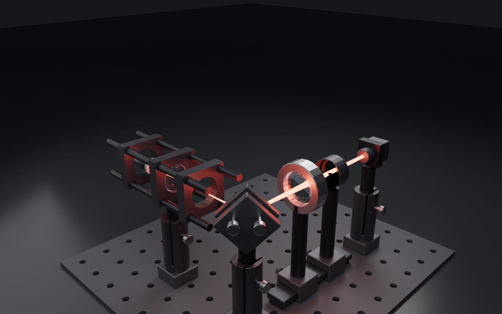
</p>

*A **hybrid** bench mixes all three systems on one breadboard — a cage launcher → a free-space
post-mounted turning mirror → a rail-mounted analyzer train into a camera. Grouping optics into a
cage/tube/rail never moves them, so every system's beam path stays byte-identical to the bare bench.*

---

## Why this exists

While driving Blender through the MCP, an AI agent literally **could not see** the optics: where
each mirror's center was, which way its surface normal pointed, where a beam would actually go.
The optical truth was hidden behind object origins and arbitrary rotations, so alignment was
guesswork.

So — *see a need, fill a need.* This add-on makes the geometry explicit. Every element carries
its **ports** (entry / exit / reflective surfaces) as world-space **position and normal**,
recoverable no matter where the object's origin sits or how its mesh is rotated:

```text
world_position = obj.matrix_world @ local_position
world_normal   = (obj.matrix_world.to_3x3() @ local_normal).normalized()
```

On that foundation it builds a live beam tracer, kinematic-mount alignment, a physics layer, and
a render pipeline — all readable by both humans (the Optics panel) and agents (`optics_api`
returns the full state: ports, world normals, beam path, detector readings).

---

## How it works

The add-on separates the **optical slot** from the **physical part**, and keeps the truth in a
few small, inspectable layers:

- **Data model** — optical state lives on `Object.optics` (a PropertyGroup), *independent of the
  mesh*. It holds the element type, ports, base pose, degrees of freedom, mount, and physics
  parameters. Because ports are stored in local space, world ports follow `matrix_world`
  automatically — the same math the tracer and alignment rely on. Swapping an element's mesh
  keeps its optical slot intact.
- **Tracer** (`tracer.py`) — sequential ray tracing. Each ray carries its Jones vector, optical
  path length, Gaussian `q`-parameter, a 3-D complex field `evec`, and a Zernike wavefront-error
  vector `aberr`. Elements dispatch on type (reflect / split / transmit / diffract / aberrate /
  correct / terminate). It is drawn as a **GPU overlay** that updates as you drag parts — no mesh,
  no undo spam.
- **Mounts & alignment** (`mounts.py`, `alignment.py`) — `compose_pose` writes `matrix_world`
  *absolutely* from a base pose + kinematic DOFs (tip / tilt / rotate / translate), each with a
  real range. **Auto-align** drives only the knobs and reports *"move the post"* when a target is
  out of a mount's reach. Relative placement and assemblies feed the base pose / an anchor.
- **Physics** (`physics.py`) — a dependency-free module (see below) with a closed-form self-test.
- **Sensor window** (`monitor.py`) — a framed picture-in-picture panel docked to the viewport's
  bottom-left, rebuilt every redraw, showing what a detector *records*.
- **Render** (`render.py`, `bake.py`) — bake beams to emission tubes, set a camera + backdrop,
  one-click EEVEE / Cycles.
- **API & bridge** (`optics_api.py`, `bridge.py`) — a JSON-able facade over the same core, plus a
  localhost socket server so an external MCP process can drive a *running* scene.

---

## Features

- **Explicit optical data model** — ports as world-space position **+ normal**; the true
  geometry is always recoverable (origin offsets and rotations no longer hide it).
- **Live beam tracer** — sequential ray tracing (reflect / split / transmit / diffract /
  terminate) drawn as a GPU overlay that updates as you drag parts. No mesh, no undo spam.
- **Live sensor window** — a framed picture-in-picture panel docked to the viewport's
  bottom-left corner showing what a detector *records* (its 2-D intensity / fringe pattern),
  rebuilt every redraw so it's always live and never goes stale. Per-detector sensor model
  (resolution, pixel pitch, exposure / read-noise / saturation); render-independent (it never
  appears in an F12 render) yet savable to PNG on demand.
- **Kinematic mounts** — rig a static vendor mesh with the tip/tilt/rotate/translate knobs it
  lacks, each with a real range; **auto-align** drives only the knobs and says *"move the post"*
  when a target is out of reach.
- **Realistic opto-mechanics (Dress Bench)** — one click puts the whole setup on a real bench:
  a **tapped-hole breadboard** (metric 25 mm / M6 or imperial 1″ / 1/4-20, a scene setting) on
  feet, every optic at one **beam height** on a Ø12.7 mm post + post-holder (locking thumbscrew),
  and **mount-type-correct hardware** — kinematic mirror mounts with knurled adjusters (2-axis
  KM100 or 3-axis KS1), cube beamsplitter mounts, threaded lens cells, waveplate rotation collars,
  camera C-mounts. Group optics into a **cage** (16/30/60 mm rods), a **lens tube** (SM05/SM1/SM2
  barrel) or onto a **dovetail rail** with carriers. All original GPL-clean geometry to the real
  functional dimensions (no vendor CAD); pure decoration that never moves the optics, so the trace
  is unchanged. The full bench — grid, beam height, post chain, and each optic's mount/system — is
  exposed in `get_state()` so an agent can read and build a layout.
- **Opto-mechanical limits** — warns when a post pulls out of its holder or a cage rod leaves
  its bore.
- **Alignment report** — per-element position/angle residuals with OK/Warn/Bad states and
  viewport color feedback.
- **Component library** — a broad built-in catalog of **38 real vendor parts** (Thorlabs & co.)
  addressable by part number. Import your own CAD (STL/OBJ natively, **STEP/IGES via FreeCAD**),
  or let an entry fall back to correct **generic mesh-free geometry** when the CAD isn't on disk —
  so every catalog entry is usable immediately.
- **Swappable parts** — fill or replace an element's mesh from the catalog or an imported file
  while keeping its optical *slot* (ports, pose, mount, beam role); do it for one element or in
  **bulk** (by type / mount / name prefix).
- **Relative positioning & assemblies** — place an element a set distance from another along a
  chosen axis or its outgoing beam, group parts under an **anchor** that moves them together, or
  link "B follows A" so a dependent element tracks its reference live.
- **Render helper** — one-click EEVEE preview / Cycles final, camera presets (Hero/Top/Front/Side),
  beam baking, and **background presets** (Dark / Black / White-paper / **Transparent** alpha-PNG
  for figures).
- **Canonical examples** — one-click Mach-Zehnder, Michelson, Hong-Ou-Mandel, Bell/entanglement,
  **adaptive-optics**, and **Newton's-rings** setups, built from portable generic components.
- **Adaptive optics (closed loop)** — a modal (Zernike) wavefront sensor + deformable mirror: an
  aberrator injects wavefront error, the sensor reconstructs it (false-color map + RMS in the
  sensor window), and a closed-loop integrator drives the deformable mirror until the wavefront
  flattens (RMS → 0) — live, inside the single-ray model.
- **Scriptable & agent-drivable** — every core action is exposed through `optics_api` (JSON-able
  state in, structured results out) and a localhost **MCP bridge**, so a script or an AI agent can
  build, align, swap, position, scan, and render a *running* scene headlessly.

---

## Physics layer

The physics lives in a single dependency-free `physics.py`. Every formula in the table is
checked against an external **symbolic + numerical oracle** (the `physicist` verifier: units,
symbolic identities, limits, and known input → known answer), so the engine is not
"dimensionally plausible" — it is *verified*.

| Layer | Models | Validated against |
|-------|--------|-------------------|
| **Polarization** | Jones vectors/matrices: source state, polarizer (Malus), waveplate (HWP/QWP + fast axis), PBS (s/p); Stokes/**DOP** for partial & unpolarized light | Malus cos²θ, QWP→circular, PBS 50/50 |
| **Interference** | coherent recombination (OPL→phase), coherence envelope from linewidth, fringe **visibility**; complementary Mach-Zehnder outputs | V=1 at zero OPD, energy conservation |
| **Wavelength** | dichroic routing by cut-λ, filters (LP/SP/BP/ND), grating equation `mλ = d·Δsinθ`, **dispersion** n(λ) (Sellmeier) | grating angle, d-line n(587.6)=1.5168 |
| **Gaussian beam** | complex q-parameter through free space + lenses (ABCD), spot size w(z), aperture clipping; **wavefront curvature R(z)** + **Gouy phase** rendered into the fringes (curvature → curved/ring fringes, exp(−ρ²/w²) **apodization**), plus a tilted-detector **cos θ** obliquity factor | focal spot λf/πw₀, Gouy→±90°, oracle 10/10 |
| **Wavefront / adaptive optics** | modal Zernike wavefront error per beam (Noll j=1..15), aberrator / deformable mirror / wavefront sensor, closed-loop modal correction (integrator) | Zernike orthonormality + RMS (oracle), loop RMS 0.56→0 |
| **Advanced** | **exact vectorial (3-D)** Fresnel at an arbitrary mirror tilt (true s/p phase, linear→elliptical), white-light fringe packets, detector **camera model** (shot/read noise, saturation), one-way **isolators**, **Fabry-Pérot** cavities (Airy/finesse/FSR) | Fresnel Brewster/normal, Airy comb, finesse |
| **Quantum (analytic)** | Hong-Ou-Mandel dip, Bell **CHSH** | R(0)=0, \|S\|=2√2 |

Analysis tools — **Scan + Plot** (interferogram / Malus / spectrum), **Detector Fringe Image**
(2-D pattern), **Power Budget**, **Quantum Readout** — paint their result into the live sensor
window (and still save a PNG + CSV), so everything stays in one place, on-screen, and queryable.
A finite source linewidth localizes the fringes into a **white-light packet** near zero OPD:

<p align="center">
  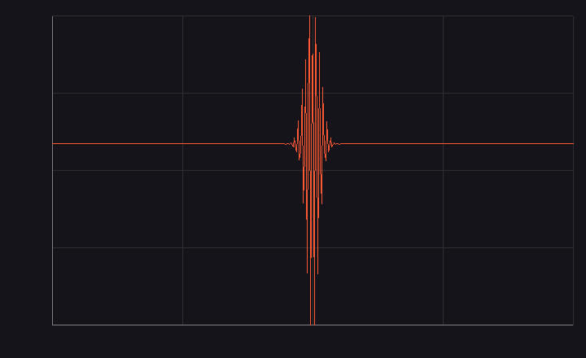
</p>

Run the self-test with a bare interpreter (no Blender needed):

```bash
python3 optical_alignment_sim/physics.py   # -> PHYSICS SELFTEST PASSED
```

---

## Install

1. Build the extension zip from this repo (one command):

   ```bash
   blender --command extension build --source-dir optical_alignment_sim --output-dir .
   blender --command extension validate optical_alignment_sim
   ```

2. In Blender: **drag the zip onto the window**, or *Edit ▸ Preferences ▸ Add-ons ▸ Install from
   Disk…* and pick `optical_alignment_sim-<version>.zip`.
3. Open the **Optics** tab in the 3D viewport sidebar (press `N`).

---

## Quick start

- **Examples ▸** pick *Michelson* (or any of the six) to spawn a full setup with the live beam
  overlay.
- **Element** — select an object, *Tag as Optical Element*, then *Auto-Detect Ports* (by name) or
  *Add Port from Face* (any mesh); *Normalize Imported CAD* fixes units/scale. Per-type parameters
  appear here: source polarization, waveplate angle, mirror coating, lens focal length, …
- **Mount & Adjustment** — *Apply Mount Preset* (e.g. KM100CP/M), *Set Coarse Pose*, then drive
  the tip/tilt knobs.
- **Assembly & Parts** — *Swap Part* (catalog / file, single or bulk), *Place Relative*,
  *Create / Clear Anchor*.
- **Simulation** — toggle *Live simulation*; the beam updates as you move parts. *Start MCP Bridge*
  to let an external agent drive the scene.
- **Alignment Report** — *Update Report* / *Align* / *Align All*; detectors show measured power,
  polarization, and fringe visibility. Tick *Sensor window* to dock the live recorded pattern
  bottom-left.
- **Adaptive Optics** — *Run AO Loop* to sense a wavefront and drive a deformable mirror flat.
- **Render** — pick a camera + **Background** preset, then *EEVEE Preview* / *Cycles Final*.
  *Cycles Final* gives the optics **glass materials + studio lighting** so beam splitters and
  lenses read as real glass (toggle **Realistic optics**; **Reset Render Style** restores the flat
  editing look — the viewport itself always keeps its distinct editing colours). **Dress Bench**
  seats each optic on a post + post-holder over a real **tapped-hole breadboard** (pitch is a
  scene setting — metric 25 mm / M6 or imperial 1″ / 1/4-20) so a render reads like a real optical
  table (decoration only — never traced; toggles back off to strip it). The hole grid is exposed
  as data (`get_state()['bench']`) and an agent can `place_on_grid` parts on named holes.
  **Export SVG Schematic**
  writes a publication-ready top-view vector schematic of the layout + beam path (element glyphs by
  type, beams coloured by wavelength).

### Worked example: a Michelson interferometer

<p align="center">
  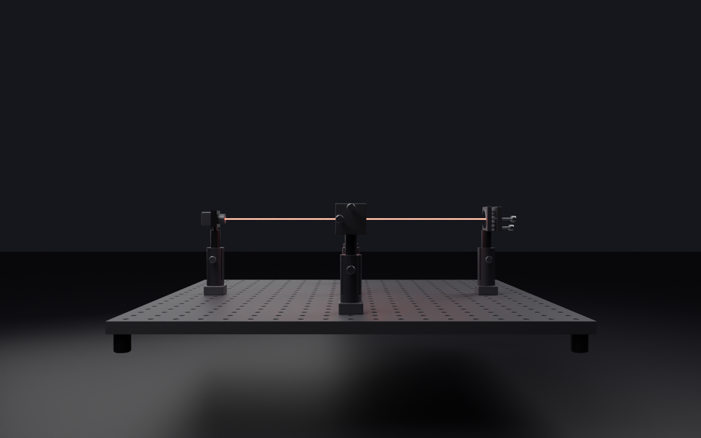
</p>

1. **Optics ▸ Examples ▸ Michelson** → laser → beam splitter → two arms → detector, with the live
   red beam path.
2. Select the beam splitter, nudge a tip knob → watch the recombined beam break; **Align All**
   walks it back onto the detector.
3. Select the moving-arm mirror, **Scan + Plot ▸ OPD stage** → the **interferogram** (a clean
   cosine of intensity vs. path difference) appears in the live sensor window and saves a PNG +
   CSV. Open a detector's **Live sensor window** to watch its recorded field go bright ↔ dark as
   you nudge the stage.
4. Give the laser a **bandwidth** (e.g. 550 ± 90 nm) and scan again → the fringes localize into a
   **white-light packet** near zero OPD.
5. Tilt a mirror and run **Detector Fringe Image** → the 2-D straight-fringe pattern, now with the
   Gaussian-beam apodization envelope and an optional camera noise/exposure model.

Try also **Examples ▸ Newton's Rings** (a lens vs. a flat reference → live concentric rings) and
**Adaptive Optics** (run the loop from the *Adaptive Optics* panel to drive a wavefront's RMS to
zero and watch the sensor's false-color map flatten).

<p align="center">
  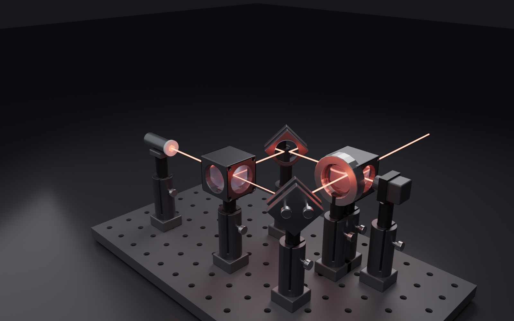
  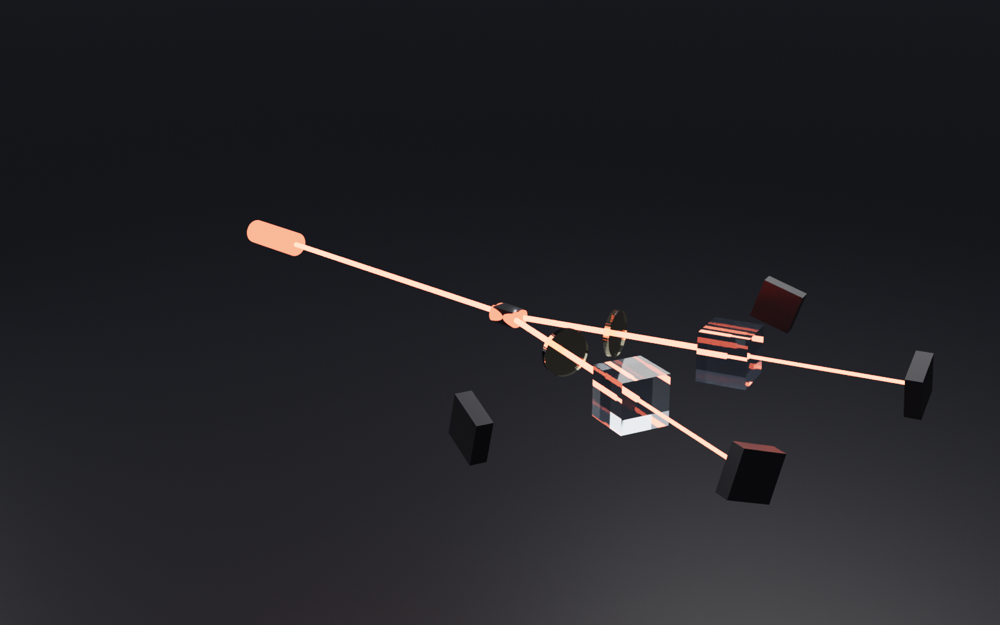
</p>

*Two more one-click benches, rendered with the realistic-optics treatment described below: the
Newton's-rings interferometer (left — note the glass lens) and the Bell entanglement source
(right). The same one-click **Cycles Final** that produced the hero up top.*

The same, headlessly, via the agent/script API:

```python
import optics_api

optics_api.build_example("michelson")   # full setup + live beam
optics_api.align_all()                    # auto-tune the knobs to the detector
state = optics_api.get_state()            # ports, world normals, beam path, detector readings
optics_api.render(preset="final", camera="hero", filepath="/tmp/michelson.png")

# adaptive optics: read the residual wavefront, then close the loop
optics_api.build_example("adaptive_optics")
optics_api.ao_measure("AO_WFS")                       # {zernike: [...], rms: 0.559}
optics_api.ao_close_loop("AO_WFS", "AO_DM", gain=0.5, iters=15)   # rms 0.559 -> ~0
```

Other API entry points: `trace_beam`, `tag_element`, `set_mount`, `set_param`, `add_component`,
`swap_part`, `place_relative`, `scan`, `beam_profile`, `get_wavefront`, `ao_command`,
`align_element`, `bake_beams`, `clear_beams`, `check_mechanics`, `export_svg`.

---

## Component library & meshes

<p align="center">
  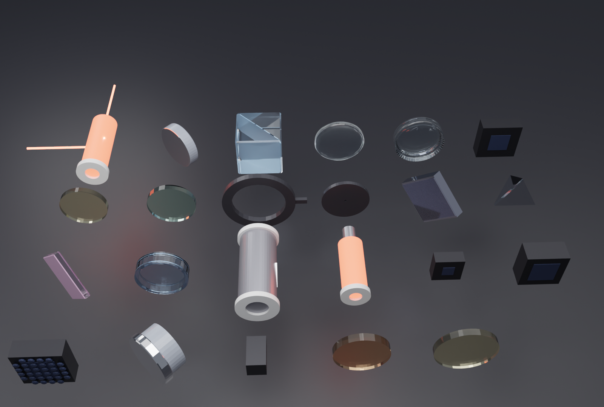
</p>

*Every element is **original GPL-clean procedural geometry** — a lens curves by the **sign of its
focal length** (converging biconvex vs diverging biconcave), an iris has a real opening, a pinhole a
real bore, a grating is ruled, a retroreflector is a trihedral corner cube, beam-splitter/dichroic
faces are coated, detectors carry a recessed active area (the wavefront sensor a Shack-Hartmann
lenslet grid). The beam tracer reads only each element's **ports**, so the geometry can look real
without ever perturbing the physics — every example trace is byte-identical before and after.*

> 📖 **[`docs/OPTICAL_ELEMENTS.md`](docs/OPTICAL_ELEMENTS.md)** — a behavior reference cataloging the
> **real-world variants** of every element (118 of them: lens forms, mirror coatings, beamsplitter/PBS
> types, waveplate orders, polarizer prisms, grating/prism families, filters, detectors, sources,
> nonlinear crystals, modulators…), **what each does to the beam**, and how each maps to the add-on's
> `element_type` + params.

Vendor 3-D models (Thorlabs, Edmund, …) are **not bundled** — they are the vendors' intellectual
property. The add-on ships only metadata (element type, port geometry, mount parameters). To use
real parts:

1. Download the CAD from the vendor into a folder.
2. Set it as **Component mesh folder** in the add-on preferences.
3. STL/OBJ import directly; for STEP/IGES, set the **FreeCAD command** (`freecadcmd`) in
   preferences and the add-on converts on import (`tools/freecad_convert.py` for CLI use).

The built-in catalog (38 real parts — lasers, mirrors, prism/corner-cube mirrors, beam splitters,
dichroics, gratings, retroreflectors, lenses, waveplates, polarizers, filters, attenuators,
isolators, apertures, pinholes, fiber collimators, photodiodes, power-meter heads) references
meshes by filename. Without the CAD, **Add Component** still spawns a correct generic element, so
the catalog is fully usable out of the box.

---

## Driving it from an agent (MCP)

The whole point: an AI agent can *see* and *drive* a running optical scene. A dedicated **MCP
server** connects to a localhost socket bridge built into the add-on — build setups, read the
full optical state (ports, world normals, beam path, detector readings, **bench grid + beam height
+ each optic's mount/system**), align, swap parts, position elements, scan, run the AO loop, and
render. Opto-mechanics is agent-drivable too: `dress_bench`, `set_grid`, `place_on_grid`, and
`make_cage` / `make_tube` / `make_rail` (+ `place_on_rail`) build a real bench layout the agent can
both read back and reposition.

1. In Blender: **Optics ▸ Simulation ▸ Start MCP Bridge** (the bridge auto-exposes every public
   `optics_api` function over localhost).
2. Run the server in [`mcp/`](mcp/README.md) and wire it into your MCP client.

For scripts and headless pipelines, `optics_api` is importable directly inside Blender
(`blender --background --python your_script.py`) and is aliased to a stable top-level name when the
add-on is enabled.

### Examples (standalone scripts)

`examples/` contains builders that run with or without the add-on installed:

```bash
blender --background --python examples/mach_zehnder.py
```

---

## Roadmap

- CAD-assisted DOF extraction from STEP geometry + datasheets
- POV-Ray / Asymptote export for publication figures
- Larger adaptive-optics variants: a literal Shack-Hartmann lenslet sensor, a zonal
  actuator-influence deformable mirror, and surface-generated higher-order aberrations

*Recently shipped:* **SVG schematic export** (publication-ready top-view vector figures: *Render ▸
Export SVG Schematic*, `optics_api.export_svg`, MCP tool), **continuous integration** (every push
runs the physics self-test, `extension validate`, and the headless regression on a real Blender —
it has already caught a cross-platform beamsplitter-unitarity bug), exact **vectorial (3-D)
polarization** for off-axis Fresnel, the **MCP bridge** above, a modal **adaptive-optics loop**
(Zernike wavefront sensor + deformable mirror + closed loop), **Gaussian-wavefront fringes**
(curvature + apodization + Gouy + oblique-detector cos θ), and a **Newton's-rings** example that
paints that curved wavefront as live concentric rings.

---

## License & credits

**GPL-3.0-or-later.** See [`LICENSE`](LICENSE). Vendor CAD/meshes are not included and remain the
property of their respective owners; this project ships only original metadata and tooling.

Built in the spirit of Bigweld's maxim from *Robots* (2005) — **"See a need, fill a need."**
