# Blender Optics Simulator

[](https://github.com/emircbngl/blender-optics-simulator/actions/workflows/ci.yml)
[](https://github.com/emircbngl/blender-optics-simulator/releases/latest)
[](LICENSE)
[](https://www.blender.org/)
[](https://doi.org/10.5281/zenodo.20778997)

**An optical bench an AI agent can build, inspect, align, and render — over MCP.**

> *"See a need, fill a need."* — Bigweld, *Robots* (2005)

> **60-second tour** — Lay out lasers, mirrors, beamsplitters, lenses, waveplates, gratings and
> detectors in Blender; a **live beam engine** traces them (ray + Gaussian-q ABCD + Jones/Stokes
> polarization + wave-optics overlays), all **physics-verified** against textbook answers in CI.
> Everything mounts on **real opto-mechanics** and renders in **Cycles**. The whole optical state is
> exposed over a localhost **MCP bridge**, so an AI agent reads ground-truth geometry and beam data
> and **drives the bench** — aligning, closing an AO loop, nulling fringes. **Install:** drag the
> one-click link from the [releases page](https://github.com/emircbngl/blender-optics-simulator/releases/latest)
> into Blender 4.2+ (it also subscribes you to updates — see *[Install & stay updated](#install--stay-updated)*).

Blender becomes a physics-checked optical bench: lasers, mirrors, beamsplitters, lenses, waveplates,
polarizers, gratings, deformable mirrors, detectors — laid out in 3-D, traced by a live beam engine,
mounted on real opto-mechanics, and rendered in Cycles. The twist: the *entire* optical state is
exposed as JSON over a localhost **MCP bridge**, so an AI agent (e.g. Claude) doesn't guess geometry
— it reads every element's pose, port normals, beam path, mount limits, and wavefront error as
**ground truth**, then drives the bench toward design intent and watches the beam update live.

This is the one place **Blender × optics × MCP/AI-agents** actually overlap. Most Blender-MCP work is
geometry and animation. This is a physics-grounded digital twin of a real optical table that an agent
can *see* and *close the loop* on.

<p align="center">
  <picture>
    <source media="(prefers-color-scheme: light)" srcset="docs/img/hero-bench-light.png">
    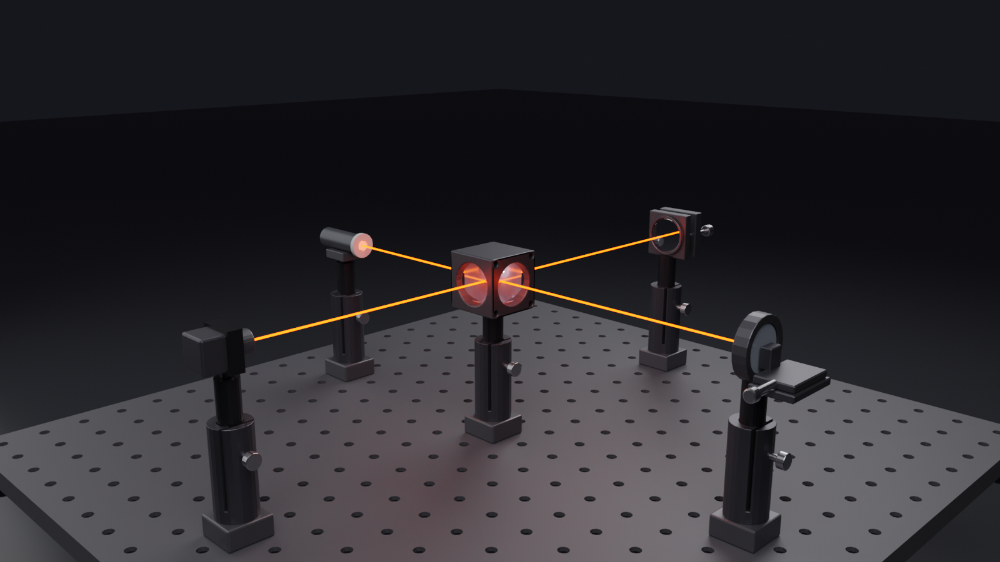
  </picture>
</p>

<p align="center"><em><b>A real bench, traced live.</b> Every mount, post, base and beam above is placed and computed by the add-on — then rendered in Cycles. Build it by hand in the UI, from a script, or let an AI agent drive it over MCP.</em></p>

<p align="center">
  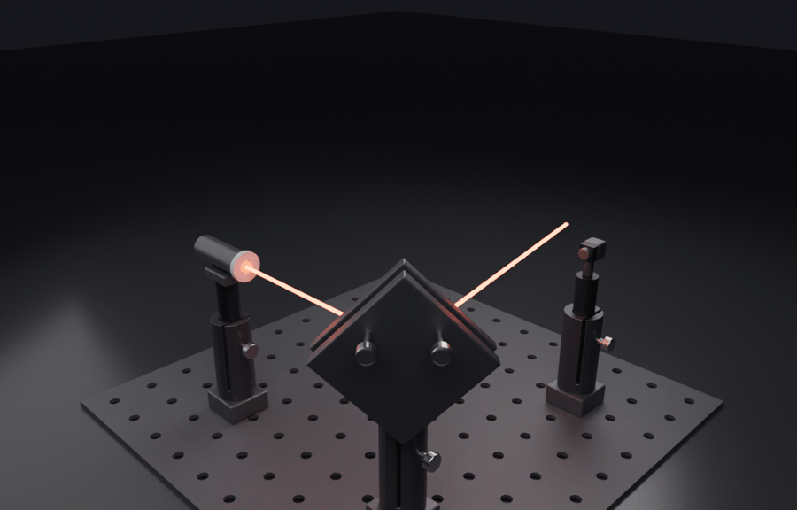
</p>

<p align="center"><em><b>Alignment, solved.</b> A kinematic mirror is knocked out of alignment, so the beam misses the detector — then one <code>optics_api.align_element()</code> call solves the pointing residual (7.0 → 0.001 mrad) and the beam locks onto the sensor. See <a href="examples/agent_align.py"><code>examples/agent_align.py</code></a>.</em></p>

---

## The core loop

An agent doesn't fly blind — it has the optical truth and iterates against it:

```text
get_state()  →  read every element's world pose, port positions+normals, mount DOFs,
                 traced beam path, detector readings, wavefront error  (full JSON)
   ↓ decide
action()     →  align a mirror · scan OPD · place a part on a grid hole · close the AO loop
   ↓
beam re-traces live  →  next iteration
```

`get_state()` returns the *whole* bench as JSON — elements, sources, detectors, beam path, bench
grid, cages/tubes/rails, and mechanical-limit warnings — so the agent always knows where things are
and where the light goes. **30 functions** are exposed over MCP; the bridge whitelists only the
curated `optics_api` facade.

---

## Drive it with an AI agent (MCP)

<p align="center">
  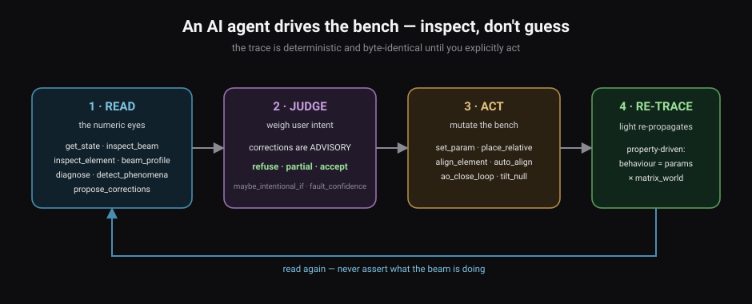
</p>

1. In Blender: **Optics ▸ Simulation ▸ Start MCP Bridge** (exposes every public `optics_api`
   function on `127.0.0.1:9765`).
2. Run the bridge server in [`mcp/`](mcp/README.md) and wire it into your MCP client.

Then the agent can **READ** the bench, **WRITE** changes, and **COMPOSE** subsystems:

```python
import optics_api

# COMPOSE — bootstrap a canonical bench in one call
optics_api.build_example("michelson")        # full setup + live beam

# READ — the agent's numeric eyes: ground truth, not guesses
state = optics_api.get_state()               # poses, port normals, beam path, mounts, detectors
optics_api.inspect_beam("MI_BS")             # power, w, R(z), M², divergence, polarization, coherence here
optics_api.inspect_element("MI_BS")          # what this optic DOES + its live in/out by kind, throughput
optics_api.beam_profile("MI_D")              # Gaussian w(z), waist, aperture clipping
optics_api.detect_phenomena()                # flags interference / off-axis-hologram conditions the trace meets
optics_api.propose_corrections()             # advisory fixes you JUDGE (refuse / partial / accept)

# WRITE — act, then the beam re-traces
optics_api.align_all()                       # auto-tune every kinematic knob toward its target
optics_api.set_param("MI_BS", "split_ratio", 0.5)
optics_api.place_on_grid("MI_M_fixed", 6, 2) # slide a part to a real breadboard hole
optics_api.scan(kind="STAGE", lo=0, hi=2e-3, steps=120, element="MI_M_stage")  # interferogram PNG+CSV

# Adaptive optics: sense the wavefront, then close the loop
optics_api.build_example("adaptive_optics")
optics_api.ao_measure("AO_WFS")                                 # {zernike:[...], rms: 0.559} (incl. beam defocus)
optics_api.pyramid_wfs("AO_WFS")                                # same wavefront read as a SLOPE sensor
optics_api.ao_close_loop("AO_WFS", "AO_DM", gain=0.5, iters=15) # rms 0.559 → ~0

# RENDER — photorealistic Cycles, or a turntable movie
optics_api.bake_beams()
optics_api.render(preset="final", camera="HERO", filepath="/tmp/michelson.png")
```

The full surface (each also an MCP tool): `capabilities`, `get_state`, `diagnose`,
`propose_corrections`, `detect_phenomena`, `inspect_beam`, `inspect_element`, `beam_profile`,
`sensor_capture`, `ao_measure`, `get_wavefront`, `pyramid_wfs`, `zonal_render`, `coupling_efficiency`,
`check_mechanics`, `build_example`, `trace_beam`, `path_statistics`, `tag_element`, `add_component`, `swap_part`,
`place_relative`, `set_mount`, `set_param`, `align_element`, `align_all`, `auto_align`, `tilt_null`,
`design_telescope`, `design_4f`, `mode_match`, `scan`, `render`, `render_sequence`, `bake_beams`,
`clear_beams`, `export_svg`, `dress_bench`, `set_grid`, `place_on_grid`, `make_cage`, `make_tube`,
`make_rail`, `place_on_rail`, `ao_command`, `ao_close_loop`. Call `capabilities()` first — it returns a
self-describing manifest (read [`mcp/AGENT_GUIDE.md`](mcp/AGENT_GUIDE.md) for the conventions and the
refuse / partial / accept judgement model).

Five repeatable **`/optics-*` skills** ship in [`.claude/skills/`](.claude/skills/) (build · align ·
inspect · correct · sensor-render) — model-invoked workflows that sequence these tools and carry the
disciplines (inspect-first, byte-identical, advisory-corrections-you-judge).

For headless pipelines, `optics_api` is importable directly inside Blender
(`blender --background --python your_script.py`).

### Detector path length, shutters, and custom meshes

`path_statistics()` reports every source-to-detector arrival separately. It reconstructs the
parent-indexed route and returns both its geometric length and the tracer's accumulated **phase OPL**:

```python
stats = optics_api.path_statistics()                 # all detector terminals
one = optics_api.path_statistics("MyDetector")      # one detector
```

The result deliberately says `group_delay_available: false`. The current tracer carries phase-index OPL;
it does **not** model group index, group delay, or GDD, so the number must not be presented as an ultrafast
time-of-flight result. In the UI the same phase OPL/geometric range appears under **Inspect → Optical Report**.

A binary shutter is available from the component library under the key `SHUTTER`:

```python
created = optics_api.add_component("SHUTTER", location=(0, 0, 0))
optics_api.set_param(created["name"], "shutter_open", False)  # block
optics_api.set_param(created["name"], "shutter_open", True)   # transmit
```

For a custom CAD/mesh component, import the STL/OBJ in Blender, select it, then use **Optics → Setup →
Element**: enable *Optical element*, choose an existing *Element Type*, click **Tag Element**, then **Detect
Ports**. Advanced mode lets you pick/edit the IN/OUT/REFLECT faces. The API equivalent is
`tag_element("MyMesh", "SHUTTER")`; `swap_part()` can also put custom CAD onto a generic component while
retaining its ports and optical behaviour. Mesh appearance and optical behaviour are intentionally separate:
new behaviour beyond the shipped element types still requires a tracer implementation, not only a mesh.

---

## What you can do

- **Design** a real bench — optical element types on real opto-mechanics: tapped-hole
  breadboards (metric 25 mm / imperial 1″), **9 real mount presets** (KM100/KS1/POLARIS-class
  kinematics, GM100 gimbal, RSP1 rotation, TRF90 flip, VC1 V-clamp — real DOF ranges, detents and
  clamping), Ø12.7 mm posts + post-holders, **16/30/60 mm cage** systems, **SM05/SM1/SM2 lens
  tubes**, and **RLA dovetail + X95 structural rails** with carriers — all original GPL-clean
  procedural geometry to true functional dimensions, structurally checked in CI.
- **Simulate** the light — a live beam tracer with analytic overlays: polarization (Jones/Stokes, plus a
  **per-pixel DoFP polarization camera**), interference & fringe visibility, Gaussian-beam propagation
  (ABCD `w(z)`, ROC, Gouy, M²), **modal *and* pyramid** wavefront sensing + closed-loop **adaptive
  optics**, wavelength-selective materials (interference/colored-glass filters, **soft-edge dichroics**),
  nonlinear conversion (SHG/SPDC), and acousto-optic Bragg deflection.
- **Let an AI drive it** — the agent READS numeric ground truth (`inspect_beam` / `inspect_element` /
  `get_state`), is told the **phenomena** the bench meets (`detect_phenomena`: interference, off-axis
  hologram) and the **advisory corrections** it should weigh against your intent (`propose_corrections`:
  refuse / partial / accept), and follows repeatable `/optics-*` skills — never guessing, every formula
  oracle-verified.
- **Align** — kinematic auto-alignment that drives only the mount knobs to < 1 mrad and reports
  *"move the post"* when a target is out of reach; a geometric validator flags collisions and posts
  in the beam.
- **Render** — bake beams to glowing emission tubes, one-click EEVEE preview / Cycles final with
  glass materials + studio lighting, camera presets, transparent-PNG figures, turntable movies, and
  publication-ready SVG schematics.

### 26 one-click example scenes

Each is a single `build_example(kind)` — built from portable, mesh-free generic components, fully
agent-drivable:

| Scene | What it shows |
|---|---|
| **Mach-Zehnder** | unbiased beamsplitter + dual-arm phase exploration |
| **Michelson** | translation-stage OPD fringes under single-knob control |
| **Hong-Ou-Mandel** | two-photon interference dip (analytic quantum readout) |
| **Bell / entanglement** | BBO pair source + H/V analysis, CHSH \|S\|=2√2 |
| **Adaptive optics** | aberrator + Hartmann sensor + deformable mirror, loop → ~0 RMS |
| **Newton's rings** | curved vs flat wavefront → live concentric rings |
| **Periscope** | two 45° fold mirrors raise the beam to a second deck (RS99-style) |
| **Cage system** | 30 mm cage relay: fiber → collimator → polarizer → PBS, 50/50 split |
| **Lens-tube system** | SM1-barrel 4f relay → C-mount camera |
| **Rail system** | Galilean beam expander on a dovetail rail |
| **Hybrid system** | cage launcher + post mirror + rail analyzer on one board |
| **Microscope** | infinity-corrected Köhler train, `f_obj = f_tube/M` |
| **DHM** | vertical off-axis Mach-Zehnder recording a hologram (amplitude + phase) |
| **AOM** | TeO₂ Bragg cell, 0th + frequency-shifted +1 order, θ = λ·f_a/v_s |
| **Surface figure** | oblique beam off a figured reflector → dense zonal wavefront a WFS reads |
| **Die** | a die face (the 5-pip quincunx) read as a recognizable zonal wavefront |

…plus ten more: **prism** (dispersing-prism spectrometer, white light fanned by n(λ)), **beam_router**
(rhomboid parallel-displace + tilt-invariant penta steering), **beam_profiler** (knife-edge erf scan),
**back_reflection** (a window's parasitic Fresnel retro-ghost), **green_doubler** (1064→532 nm SHG),
**spdc_source** (degenerate 810 nm signal+idler pairs), **quad_tracker** (4-quadrant position error),
**circulator** (non-reciprocal 3-port fiber router), and the **surface_figure_native /
surface_figure_diverging** WFS variants.

---

## Gallery

Everything below is produced by the add-on itself — a viewport beam trace baked to emission tubes,
the Scan + Plot operator, the Detector Fringe Image, and the live sensor window exported to PNG.

<p align="center">
  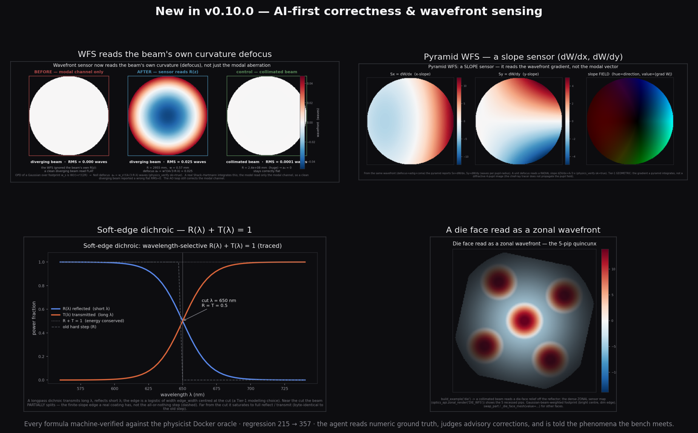
</p>

### New — catalog-true cage hardware + a structural-support gate

<p align="center">
  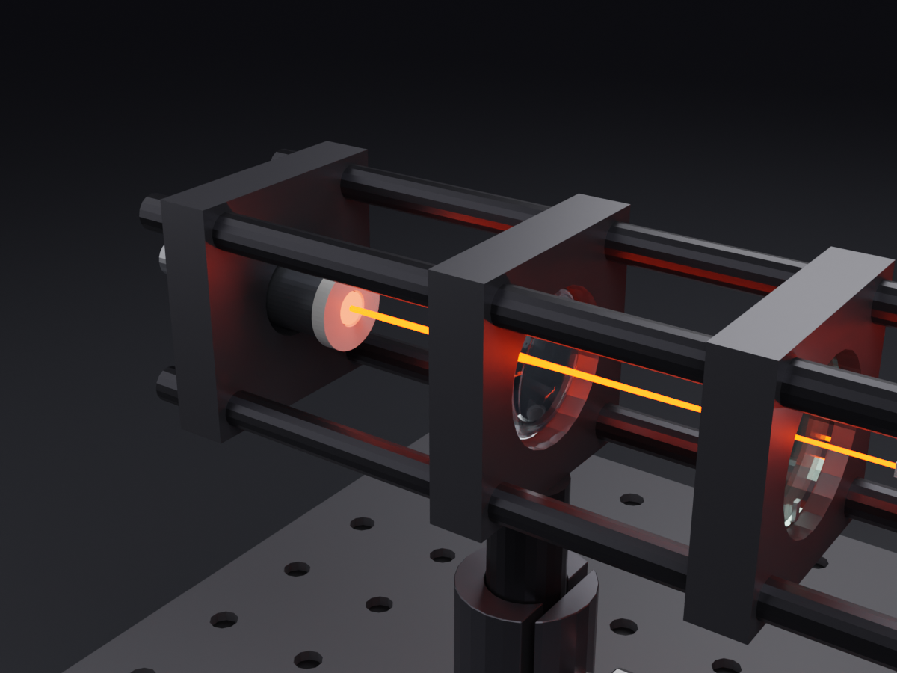
  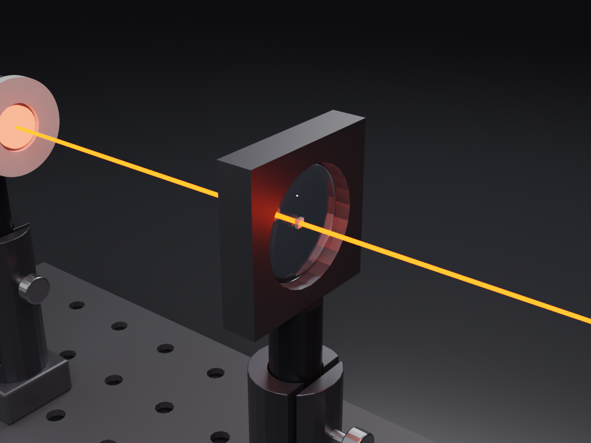
</p>

Cage assemblies now build from **real catalog parts**: rods snap to the vendors' fixed
ER/SR lengths (a 130 mm train picks the **ER6 · 152.4 mm** rod and shows the true symmetric
overhang; `cage_info()` reports the part), a single-member cage stands **rodless** on its
plate, the assembly is post-mounted through one plate's bottom tap, plate bores close onto
each optic's actual mesh, and lens tubes carry real retaining rings. Behind it sits a new
**structural-support gate**: `support_scan()` measures the mesh-level gap between every
optic and the hardware meant to hold it, and `validate()`/`diagnose()` flag anything
unsupported — so floating hardware cannot ship silently, in any scene.

<p align="center">
  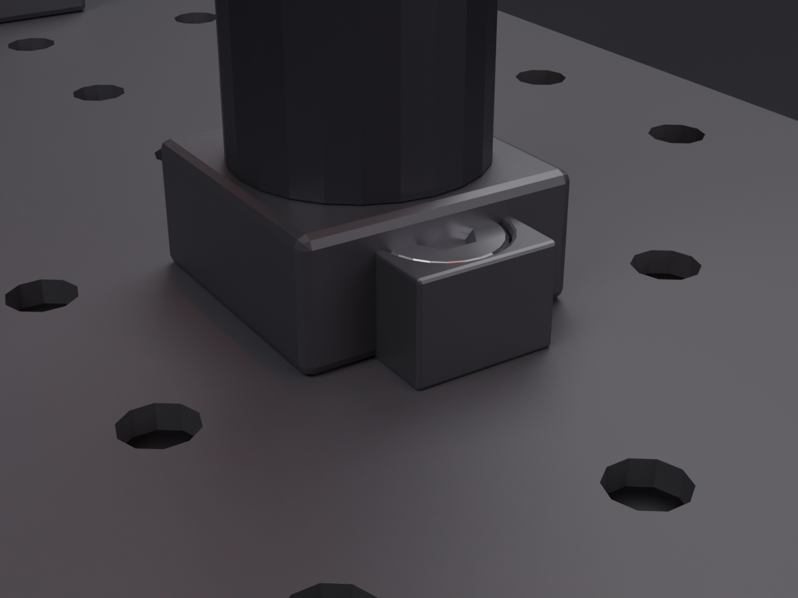
</p>

### New in v0.25.0 — expanded opto-mechanics: 9 mount presets, X95 rails, structural QA in CI

<p align="center">
  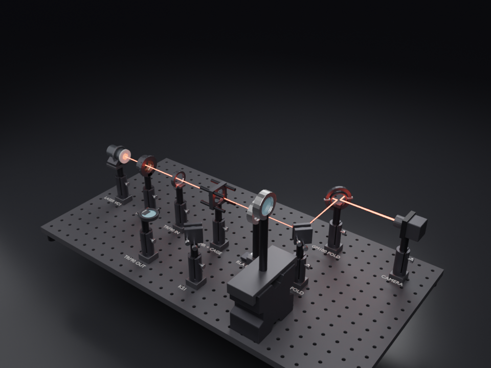
  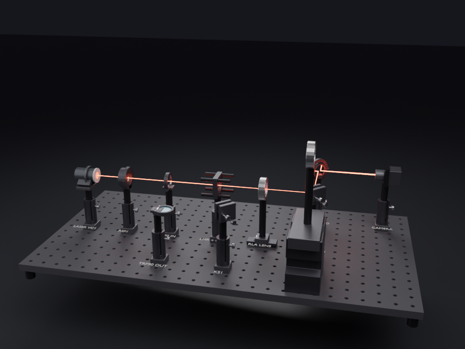
</p>

**4 new mount presets** — RSP1 rotation, GM100 gimbal, TRF90 flip with real 0°/90° detent
semantics, VC1 V-clamp for cylindrical bodies — plus the **X95 structural rail** family next to
the RLA dovetail. The whole opto-mechanical catalog was rebuilt to true functional geometry:
bases, hinges and clamps seat correctly for **any** beam direction (including folded and vertical
paths), preset apertures use the vendors' real dimensions, and every optic sits in genuine contact
with its hardware. A render-free structural check now runs in CI on every push
(`tests/test_mesh_health.py`: mesh integrity per element, part-contact analysis per mount
assembly), so the catalog cannot silently regress.

### New in v0.24.0 — laser speckle + the coffee-cup caustic (phenomena closed out)

<p align="center">
  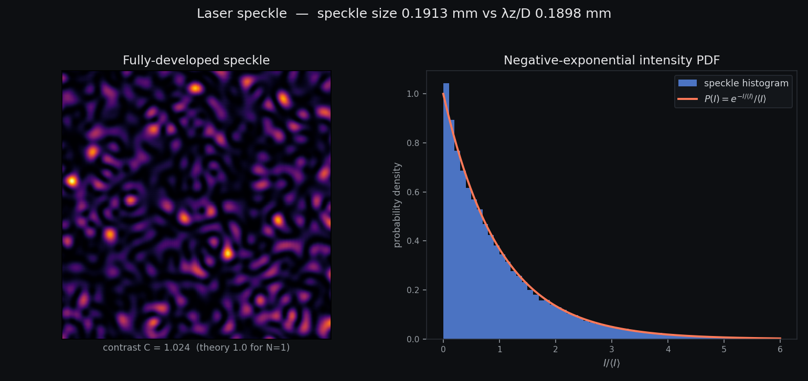
  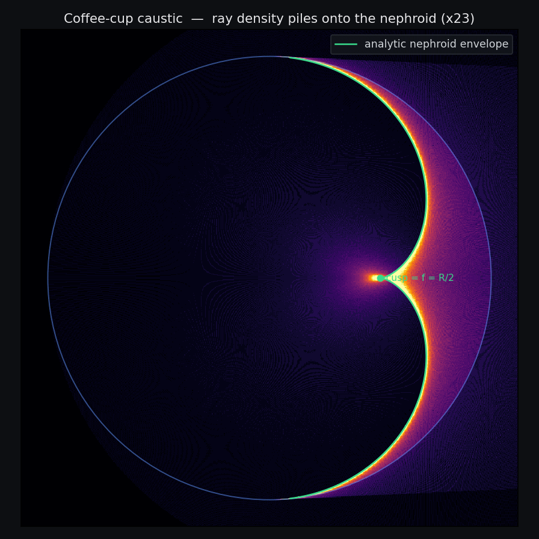
</p>

Two off-trace phenomenon producers, each derived from first principles and checked against its exact
textbook result. **`speckle_pattern()`** — a random-phase diffuser propagated to a screen gives
fully-developed **laser speckle**: contrast `σ_I/⟨I⟩ → 1`, a negative-exponential intensity PDF, mean grain
`~ λz/D`, and `1/√N` suppression when you average `N` frames (contrast + averaging law *physics_verify*
`ok=true`). **`caustic_pattern()`** — parallel rays reflecting off a circular mirror's concave wall pile up
on a **nephroid** (the coffee-cup caustic), the ray-density lighting up the analytic envelope ~20× with its
cusp exactly at the mirror focus `R/2` (reflection geometry + cusp *physics_verify* `ok=true`). This closes
the phenomenon-emergence catalog (hologram · interferogram · Fabry–Pérot · Talbot · Newton's-rings · speckle
· caustic). Also new: **`diagnose()` warns when an optic is knocked off the beam** (`optic_bypassed`) — a mid-path
lens/mirror/BS the beam no longer reaches now raises a WARN with a re-centre fix, closing a gap a render surfaced.

### New in v0.23.0 — opto-mechanical hardware rides its optic (rigid assemblies)

<p align="center">
  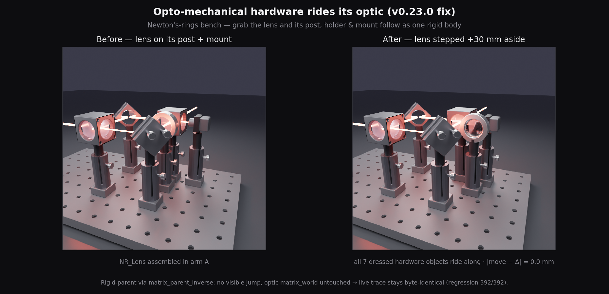
</p>

Dressed hardware (post, holder, mount) used to be built as **standalone** objects at fixed world
coordinates, so grabbing an optic — e.g. a lens in the `newton_rings` bench — left its mount behind.
Now each cluster's hardware is **rigid-parented** to its optic via `matrix_parent_inverse`, so the
whole assembly moves as one body: the parenting causes **no visible jump**, leaves the optic's
`matrix_world` untouched, and the **live trace stays byte-identical** (regression 392/392). Also new:
`inspect_all()` (a per-element dashboard) and `export_report()` (a self-contained HTML spec-sheet of
the whole bench), the always-visible in-add-on **update button**, four more glasses + CLBO/AgGaS2 +
the **As2S3/AgCl/ZnS** infrared materials (sourced, with a new `docs/DATASOURCES.md` provenance doc),
and a distinct translation-stage mount.

### New in v0.22.0 — biaxial nonlinear crystals (KTP + LBO) + Newton's-rings 2D

<p align="center">
  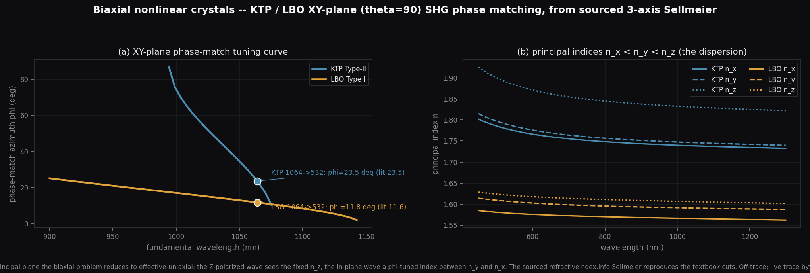
</p>

The Sellmeier-derived SHG phase matching covered only **uniaxial** crystals; this adds the two workhorse
**biaxial** doublers, **KTP** and **LBO**, with all three principal-axis Sellmeier sourced from
refractiveindex.info. In the **XY principal plane** the biaxial problem reduces to an effective-uniaxial one,
and from the sourced coefficients the solver reproduces the textbook Nd:YAG green-doubler cuts —
**KTP Type-II φ=23.58°** (lit 23.5°), **LBO Type-I φ=11.76°** (lit 11.6°) — plus their spatial walk-off (KTP
~4 mrad, LBO ~7 mrad). Off-trace calculators; the live trace stays byte-identical. *(The in-plane index order
was caught and corrected via `physics_verify` before coding — the polarization is perpendicular to the
wavevector, so `1/n² = sin²φ/n_x² + cos²φ/n_y²`.)*

Also new: **`newton_rings`** produces the 2-D Newton's-rings reflected pattern of a plano-convex surface on a
flat — `I(r)=sin²(πr²/λR)`, a central dark spot and dark rings falling exactly on `r_m=√(mλR)`
(`docs/img/newton-rings-demo.png`).

### New in v0.21.0 — birefringence: o/e double refraction + a χ² coupled-wave solver

<p align="center">
  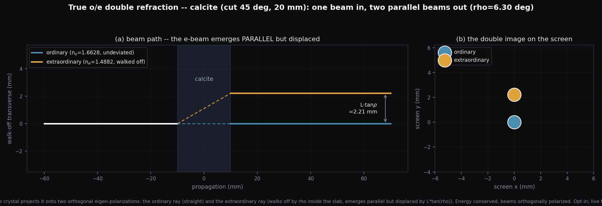
</p>

The two biggest architectural items on the backlog — both **in the live tracer**, yet **byte-identical** (each
behind a per-element opt-in flag, default off). **`oe_split`** gives a uniaxial crystal **true ordinary/
extraordinary spatial double refraction**: one beam in, two orthogonally-polarized beams out, the extraordinary
one walked off by `L·tan(ρ)` (the calcite double image). **`use_chi2_solver`** derives a nonlinear crystal's
SHG efficiency from the **full Manley-Rowe coupled-wave ODE** — pump depletion + phase mismatch, RK4-integrated,
reproducing `tanh²(√η_lin)` at phase match and `η_lin·sinc²` undepleted (both verified to ~1e-12), with the
walk-off derived from the index ellipsoid. The tracer already branches rays (beamsplitter, Wollaston) and emits
walk-off SHG children, so each is the same split-two pattern — not a new engine.

<p align="center">
  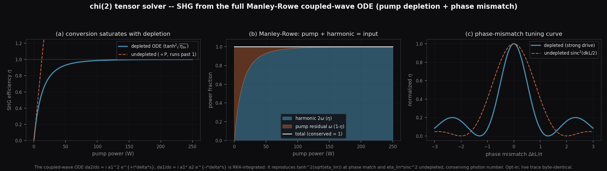
</p>

### New in v0.20.0 — wave optics: aberrated PSF, phase retrieval & cavity modes

<p align="center">
  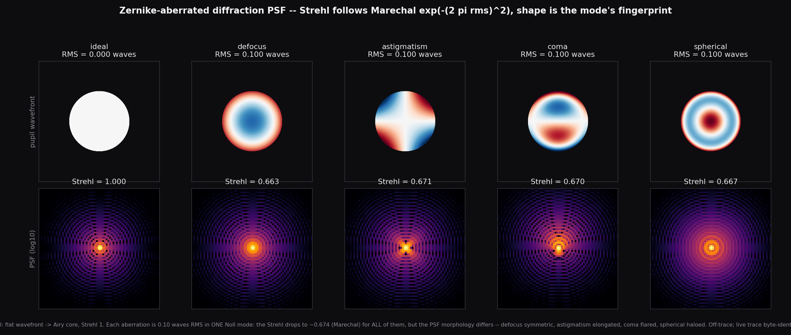
</p>

**`aberrated_psf`** — the *forward* problem (wavefront → image). `wave_psf` could only add **Z4 defocus**; this
aberrates the diffraction PSF with **any Zernike mode** (defocus, astigmatism, coma, trefoil, spherical) at a
chosen RMS, or a full Noll-indexed wavefront vector. The **Strehl** ratio collapses the same way for every
mode — it depends only on the RMS wavefront error (the **Maréchal** approximation exp(−(2π·rms)²): 0.05 waves →
0.906, 0.10 waves → 0.674) — but the PSF *morphology* is the mode's fingerprint: defocus blurs symmetrically,
astigmatism elongates, coma flares one-sided, spherical haloes.

<p align="center">
  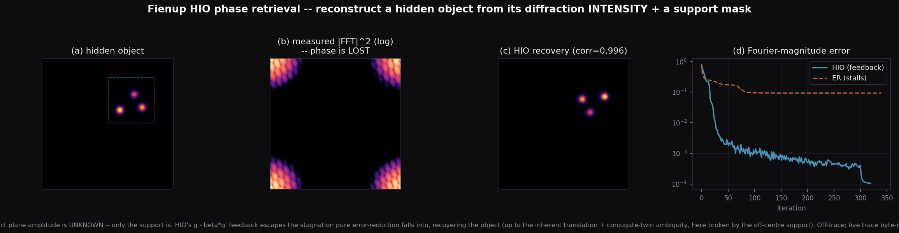
</p>

**`fienup_phase_retrieval`** — the *inverse* problem (the genuine **phase problem**). A detector records only the
diffraction **intensity** `|FFT(object)|²`; the phase is lost. Given that magnitude plus a real-space **support
mask**, Fienup's **Hybrid-Input-Output** algorithm reconstructs the hidden object (correlation 0.996, up to the
inherent translation + twin ambiguity). Where v0.19.0's Gerchberg-Saxton knows the amplitude in *both* planes
(CGH design), here the object is **unknown** — only its support is; the HIO feedback escapes the stagnation pure
error-reduction falls into.

<p align="center">
  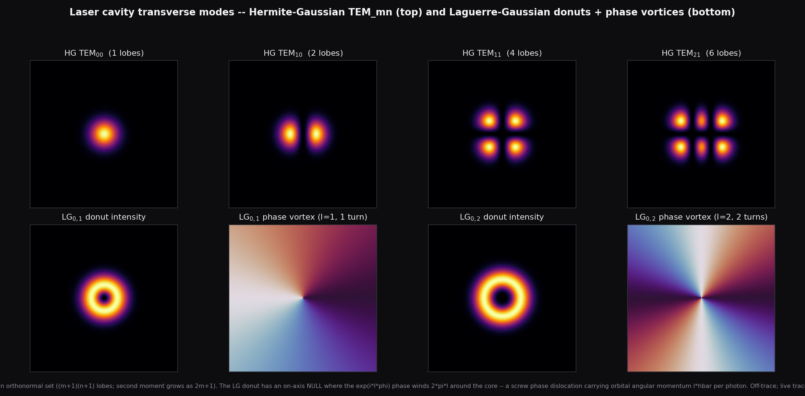
</p>

**`tem_mode`** — the laser cavity **transverse eigenmodes** a real resonator emits. `family="HG"` gives the
**Hermite-Gaussian TEM_mn** (rectangular, (m+1)(n+1) lobes, an orthonormal set); `family="LG"` gives the
**Laguerre-Gaussian** donut `LG_{p,l}` with an on-axis null and an `exp(i·l·φ)` **phase vortex** carrying
**orbital angular momentum** `l·ħ`. All three additions are off-trace; the geometric trace stays byte-identical.
*(This release also fixes a latent `NameError` that would have crashed the `gerchberg_saxton` / `spatial_filter`
/ `propagate_chain` MCP tools when called by an agent, and adds an end-to-end guard so it can't recur.)*

### New in v0.19.0 — Fourier optics: phase retrieval + spatial filtering

A Fourier-optics pair on the verified FFT: **`gerchberg_saxton`** (the iterative Fourier-transform algorithm)
*designs* a source-plane phase mask — a computer-generated hologram — whose far-field matches a target, with
the monotone-error convergence guarantee; **`spatial_filter`** (the Abbe-Porter experiment) *applies* a
Fourier-plane mask (lowpass / highpass / Zernike phase contrast that makes a pure-phase object visible). Both
off-trace; the geometric trace stays byte-identical.

### New in v0.18.0 — multi-plane field-propagation chain (`propagate_chain`)

`propagate_field` runs the angular-spectrum propagator once; the new **`propagate_chain`** marches a complex
field through a **sequence** of planes — a POPPY-style multi-plane OpticalSystem built from `prop` / `aperture`
/ `lens` steps (e.g. `aperture→lens(f)→prop(f)` focuses at z=f). Closes the optics-textbook catalog's principal
remaining gap (single plane→plane is now a chainable auto-pipeline). Validated against propagator additivity,
focus-at-f, and the free Gaussian `w(z)`. Off-trace; the geometric trace stays byte-identical. *(Near-field
layer — a tight focus or Fraunhofer far field is better via direct FFT.)*

### New in v0.17.0 — dichroic AOI edge + Sellmeier transparency window

Two physical-honesty refinements: a thin-film **dichroic mirror's edge now blue-shifts with the angle of
incidence** (a 45° dichroic sits ~8% to the blue of its normal-incidence spec — the fluorescence-microscopy
gotcha), consistent with the interference filters; and **`sellmeier_in_range`** flags when a refractive-index
query falls outside a glass's published fit window (an extrapolation, not a measured value). Both keep the
geometric trace byte-identical.

### New in v0.16.0 — Fabry-Pérot + Talbot emergence (phenomenon catalog complete)

`produce_phenomenon` now covers **all four** phenomena: `detect_phenomena` also flags a **Fabry-Pérot cavity**
and a **Talbot grating**, and `produce_phenomenon` emerges the **Airy transmission resonance** (finesse, FSR,
contrast) and the **Talbot self-imaging** (`z_T = 2 d²/λ`) — behind the same advisory accept-gate. Validation
now **163 oracle checks**.

### New in v0.15.0 — phenomenon emergence (conditions met → the phenomenon is produced)

`detect_phenomena` flags when an optical phenomenon's conditions are met; the new **`produce_phenomenon`** now
actually **produces** it — synthesizing the two-beam **interferogram** and **recording + reconstructing an
off-axis hologram** (carrier `Λ = λ/(2 sin θ/2)` → 3.63 µm, the object beam's angle recovered from the carrier
peak). It stays **advisory + intent-judged** like `propose_corrections`: a dry-run with an intent caveat first
(*"the camera may be a power meter, not a hologram plate"*), then `accept=True` emerges the pattern — never
silently. Off-trace; each result self-checks against a textbook oracle.

### New in v0.14.0 — uniaxial crystal optics + Mueller calculus

Closed-form **anisotropic-ray** numbers on the existing ordinary/extraordinary index catalog: birefringent
**walk-off angle** (calcite at 45° → 6.224°), the **index ellipsoid** n_e(θ), true zero-order **waveplate
thickness** (quartz QWP = 16.19 µm), and the **Type-I SHG phase-matching angle** (BBO 1064→532 nm → 22.78°).
Plus a **4×4 Mueller calculus** (`M_mueller_polarizer`/`M_mueller_retarder`/`stokes_through`) for
partially-polarized light, validated against py-pol / SymPy / Malus, and end-to-end CI coverage of the
waveplate crystal-birefringence dispersion branch. Validation now **152 oracle checks**.

### New in v0.13.0 — diffraction & focusing examples + a verified FDTD bridge

Single/double/N-slit **Fraunhofer diffraction**, the **Talbot self-imaging** carpet, and a Fresnel
diffraction & focusing batch (circular-aperture zones, knife-edge, Fresnel **zone-plate**, thin-lens focus,
Fabry–Pérot Airy minimum, **Newton's rings**) — each reproduced by the field engine and pinned to its
textbook closed form (validation now **136 oracle checks**). And the **FDTD bridge's Meep API is now verified**
against a real Meep 1.33.0 (12/12 vs exact analytic oracles; `tools/verify_fdtd_meep.py`), with three real
setup bugs fixed. Core trace byte-identical to v0.12.0.

### New in v0.12.0 — the physical-optics field engine (opt-in, off-trace)

A complete sampled-field layer on top of the geometric + Gaussian-q core. Every panel is computed **on
demand** and **never touches the live trace** (the byte-identical regression is preserved); every formula is
machine-verified against the physicist Docker oracle (the validation suite now runs **136 checks**).

| | |
|:---:|:---:|
| 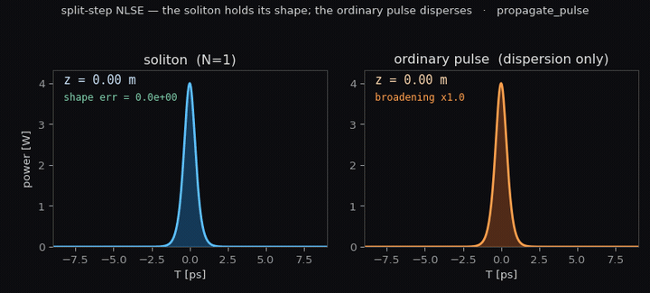 | 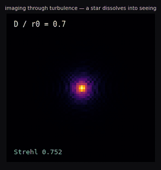 |
| **split-step NLSE** — the fundamental soliton holds its shape while an ordinary pulse disperses (`propagate_pulse`) | **imaging through turbulence** — a star dissolves into the seeing disk as D/r₀ climbs (`propagate_turbulent`) |

<p align="center"><b>▶ <a href="docs/img/field-reel.mp4">Watch the field-engine reel</a></b> — diffraction · propagation · turbulence · solitons, in 18 seconds. <em>All off-trace; the live ray-trace stays byte-identical.</em></p>

| Diffraction PSF (Fourier optics) | Free-space field propagation | Imaging through turbulence |
|:---:|:---:|:---:|
| 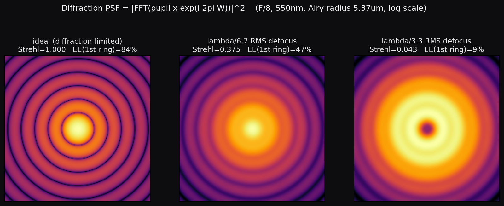 | 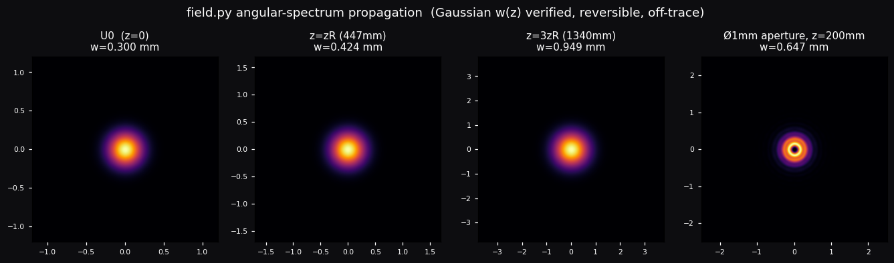 | 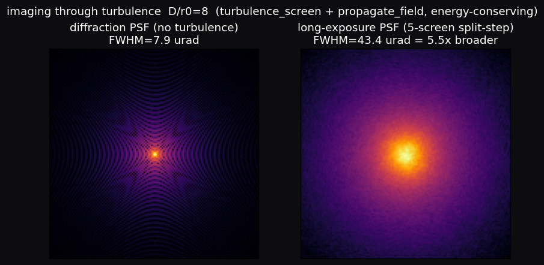 |
| `wave_psf` — PSF = \|FFT(pupil·e^{i2πW})\|² → Airy 1.22 λF#, Strehl, MTF, encircled energy | `propagate_field` — angular-spectrum: a Gaussian recovers w(z), reversible (= digital-hologram back-prop) | `propagate_turbulent` — a plane wave through 5 Kolmogorov screens; the long-exposure PSF blurs to the seeing disk |

| Atmospheric turbulence screen | Nonlinear pulse (split-step NLSE) | Monte-Carlo tissue transport |
|:---:|:---:|:---:|
| 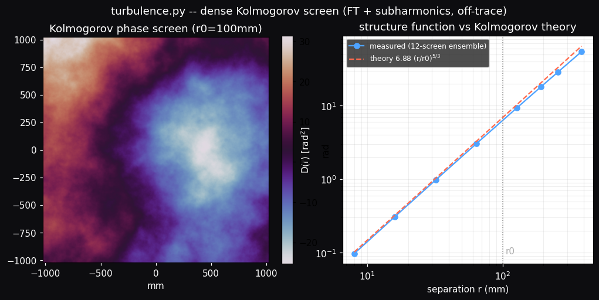 | 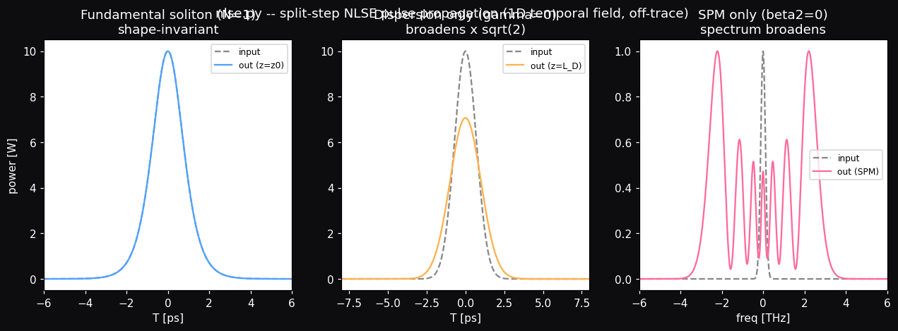 | 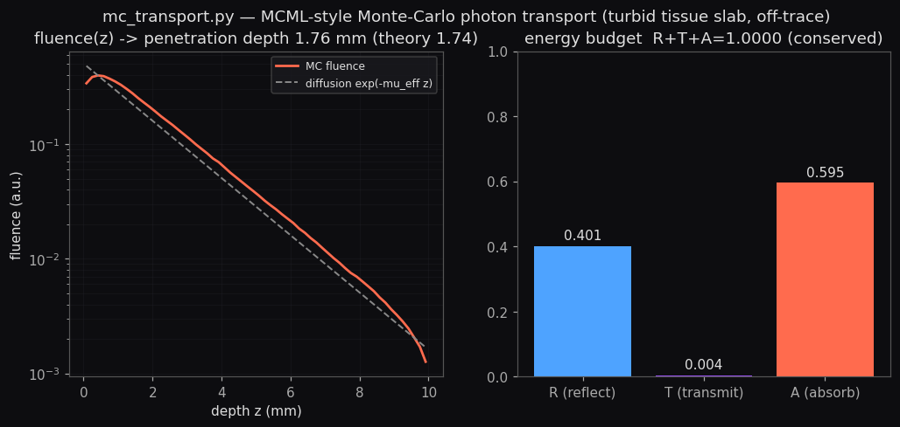 |
| `turbulence_screen` — dense Kolmogorov phase screen; D(r) = 6.88 (r/r₀)^{5/3} | `propagate_pulse` — the fundamental soliton stays shape-invariant; SPM broadens the spectrum | `monte_carlo_tissue` — MCML photon transport; R+T+A = 1, the diffusion penetration depth |

*Plus `fdtd_derive_property` (orchestrates Meep/Tidy3D for a grating/coating/metasurface, closed-form fallback
when absent), `tolerance_scan` (pose-only Monte-Carlo alignment yield), and the `/optics-scope` skill that
answers "can it simulate X?" honestly — by tier, with the verified case or the external tool to use.*

<p align="center"><b>▶ <a href="docs/img/showcase.mp4">Watch the showcase film</a></b> — build → simulate → align → wavefront → an agent driving it, end to end.</p>

<p align="center">
  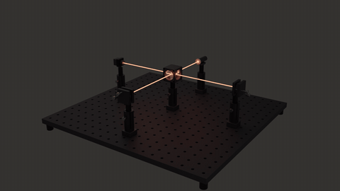
</p>

<p align="center"><em>A dressed <b>Michelson</b> on a tapped breadboard — kinematic mounts, posts, glowing beams — turntabled in Cycles (<code>render_sequence</code>).</em></p>

| Interferogram | 2-D fringes (tilted) | Malus' law |
|:---:|:---:|:---:|
|  |  |  |
| Michelson intensity vs. optical path difference | straight fringes with the Gaussian-beam apodization envelope | polarizer transmission ∝ cos²θ |

| Newton's rings | Aberrated wavefront | Corrected wavefront |
|:---:|:---:|:---:|
|  |  |  |
| a lens vs. a flat reference → concentric rings, r_m = √(mλR) | AO sensor: injected defocus + astigmatism + coma (RMS 0.56 λ) | after the closed loop → flat (RMS 0.00 λ) |

**Wavefront sensing — modal *and* zonal, honest about the difference.** The same surface figure reads
three ways through three beams; the dense zonal map keeps high-spatial-frequency relief the 15-mode
modal fit smooths away; recognizable objects (a chess knight, a die) make the map legible.

| One figure, three beams | Modal (low-pass) vs zonal (dense) | Recognizable objects |
|:---:|:---:|:---:|
| 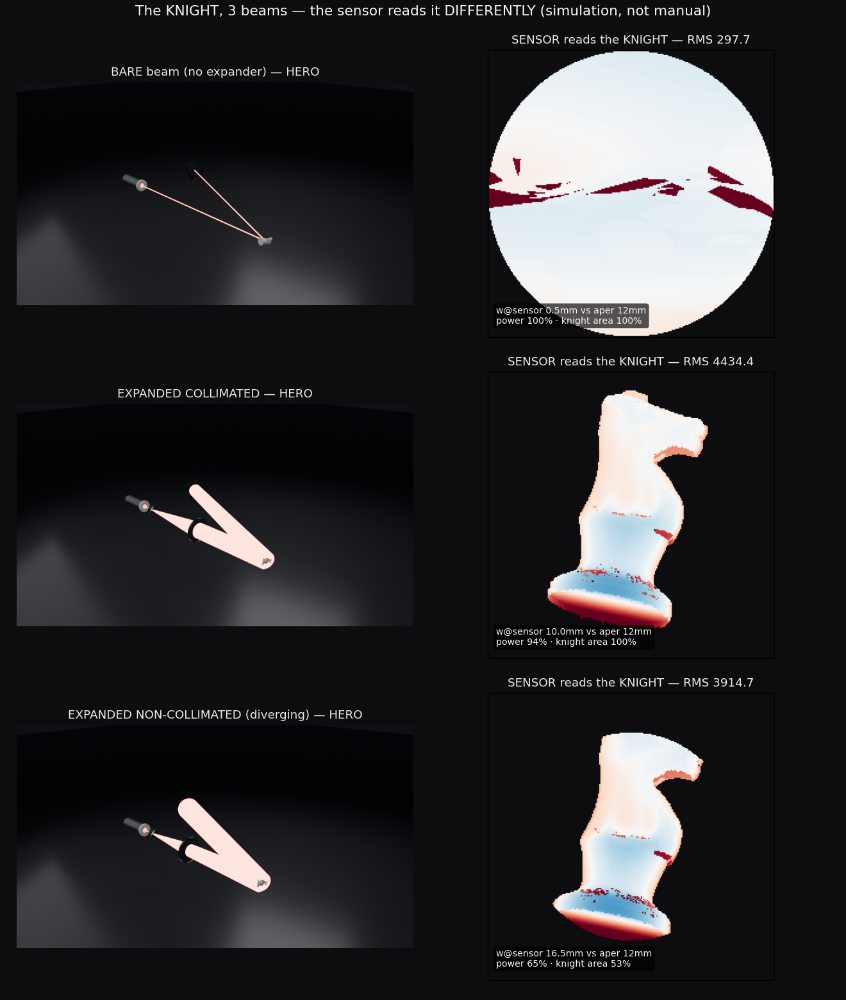 | 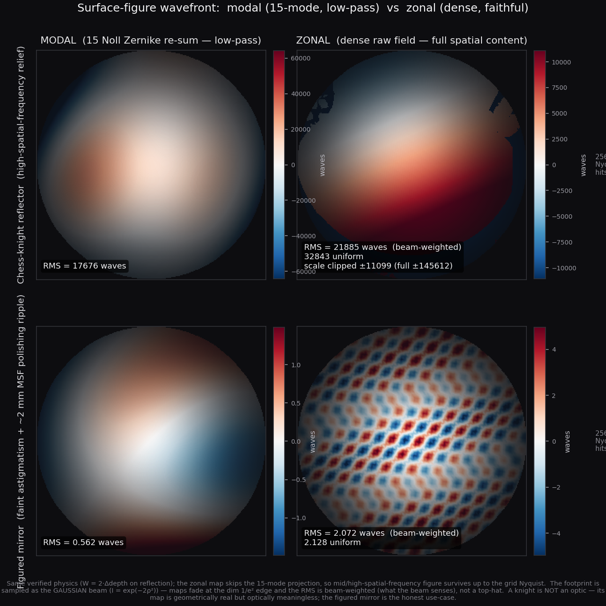 | 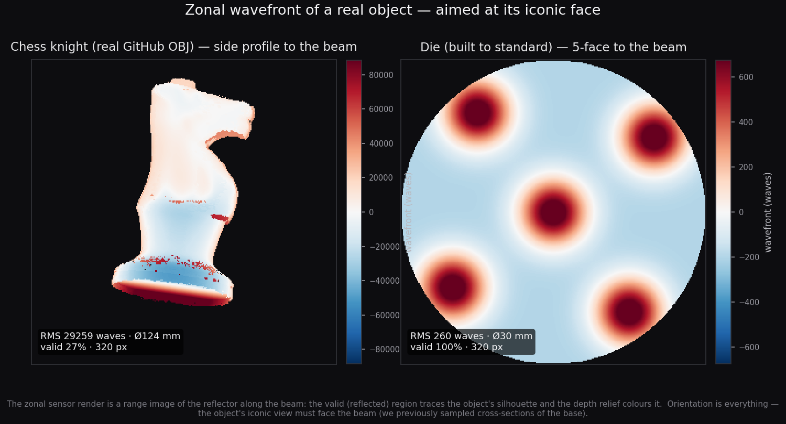 |
| bare / collimated / diverging — a finite sensor reads only its aperture, the sim produces the difference | the 15-Zernike fit vs the raw px×px field, up to the grid Nyquist | a knight + a die read as zonal wavefronts (`build_example('die')`) |

<p align="center">
  
</p>

*One-click **Dress Bench** seats every optic at one **beam height** on a real **tapped-hole
breadboard** (metric 25 mm or imperial 1″) with **mount-type-correct hardware** — kinematic mirror
mounts (KM100/KS1-style), a cube beamsplitter mount, threaded lens cells, rotation, gimbal, flip
and V-clamp mounts — on Ø12.7 mm posts in post-holders. Decoration only (never traced), so a Cycles render reads like a real
table. It's also a data model: `get_state()` reports the grid, beam height, vertical post chain, and
which hole/system each optic uses — so an agent knows exactly where things go.*

| Cage system (16/30/60 mm) | Lens tube (SM05/SM1/SM2) | Dovetail rail + carriers |
|:---:|:---:|:---:|
|  |  |  |
| collinear optics share 4 rods + one post (`make_cage`) | an in-line stack shares one barrel (`make_tube`) | carriers slide along one track (`make_rail` / `place_on_rail`; `family="X95"` for the structural rail) |

*Every mounting system is original GPL-clean procedural geometry built to real functional dimensions
(Thorlabs SM threads, ER cage rods, RLA rail) — vendor CAD is never bundled. Grouping optics into a
cage/tube/rail never moves them, so the beam path is byte-identical.*

<p align="center">
  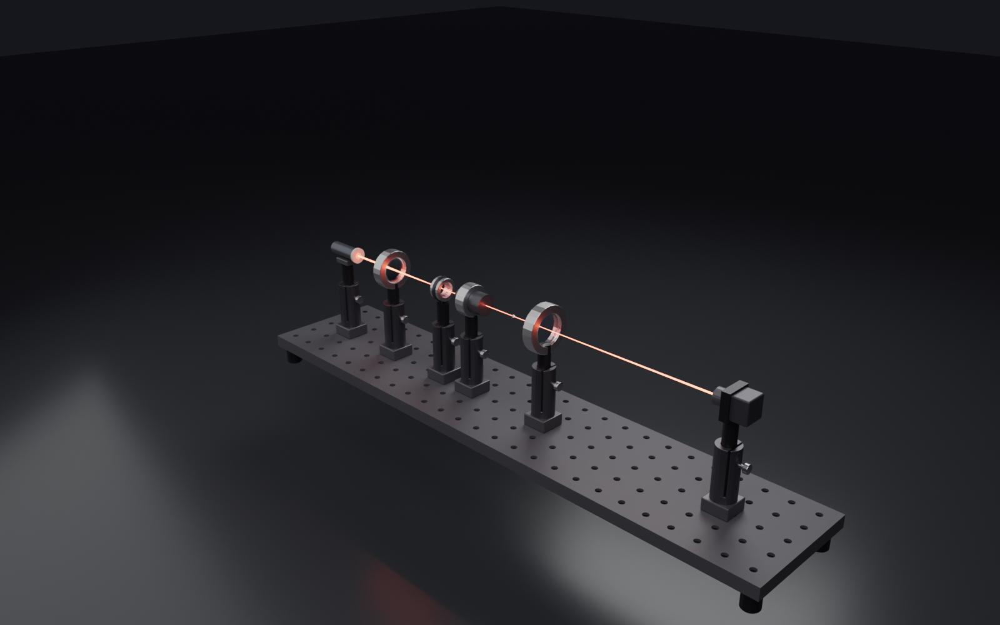
</p>

*A complete **infinity-corrected microscope**: a Köhler **lamp + condenser** image the illumination
onto the **sample**, the **objective** collimates into the infinity space, and a **tube lens** forms
the image at the **camera**. The objective is a real element — `f_obj = f_tube / M` (**oracle-verified**:
10× on a 200 mm tube lens → 20 mm), with a numerical aperture, working distance, and DIN colour ring.
Every lens applies true Gaussian-beam (ABCD) focusing, so the beam genuinely converges.*

<p align="center">
  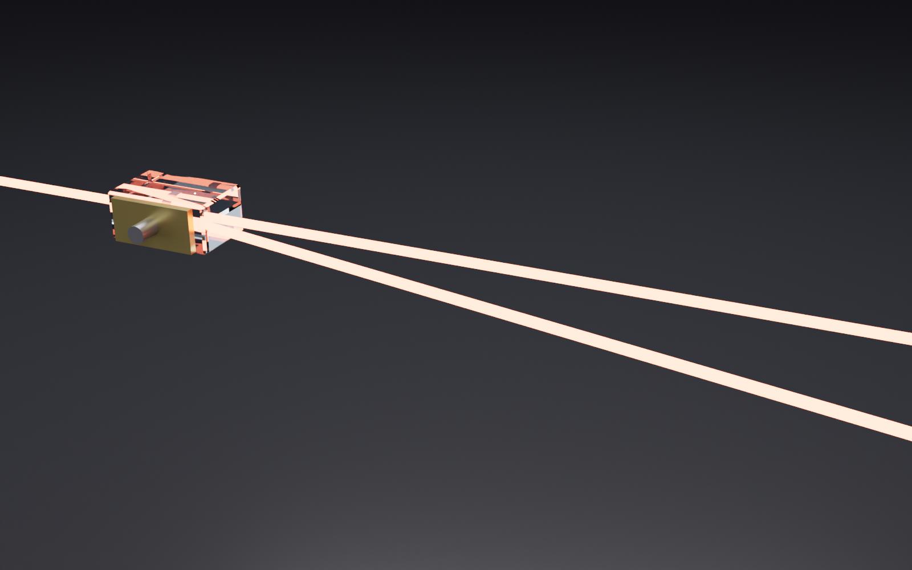
</p>

*An **acousto-optic modulator / Bragg cell** — a clear TeO₂ crystal with a **piezo transducer**
launching a travelling acoustic grating. The beam splits into the undiffracted **0th order** and a
frequency-shifted **+1 order** deflected by `θ = λ·f_a/v_s` — the **oracle-verified** Bragg relation
(shear-mode, `v_s ≈ 650 m/s`, `f_a = 200 MHz` → a visible ≈ 11°). Deflection angle, grating period,
and frequency shift are all physics-checked in the sandbox.*

**Components & physics.** Real ray-bending elements on real opto-mechanics — every behaviour from
element properties, every formula oracle-verified.

| Dispersing prism | Nonlinear crystal | Ruled / holographic / echelle gratings |
|:---:|:---:|:---:|
| 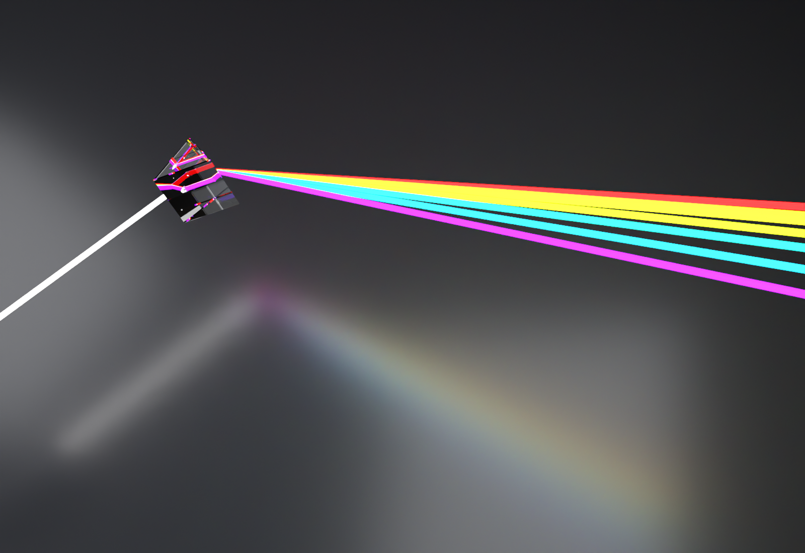 | 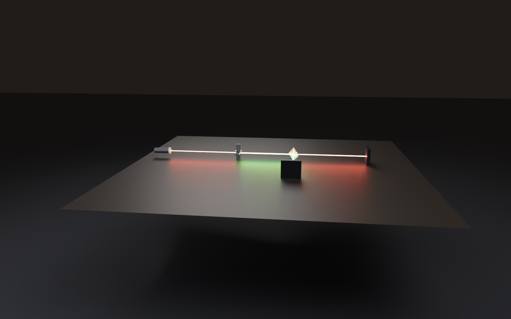 | 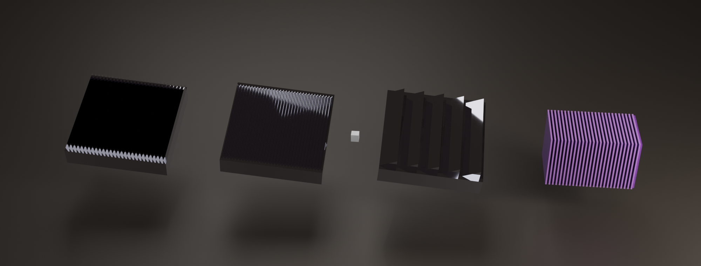 |
| vectorial Snell + real Sellmeier glasses fan white light | SHG / SPDC / OPO with phase-matching (BBO/KTP/LBO/PPLN) | ruled, holographic, echelle, and PPLN groove meshes |

| Back-reflection ghost | Coating pickoff | Closing iris |
|:---:|:---:|:---:|
| 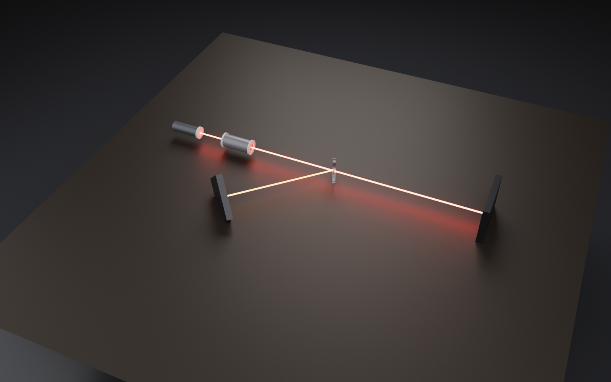 | 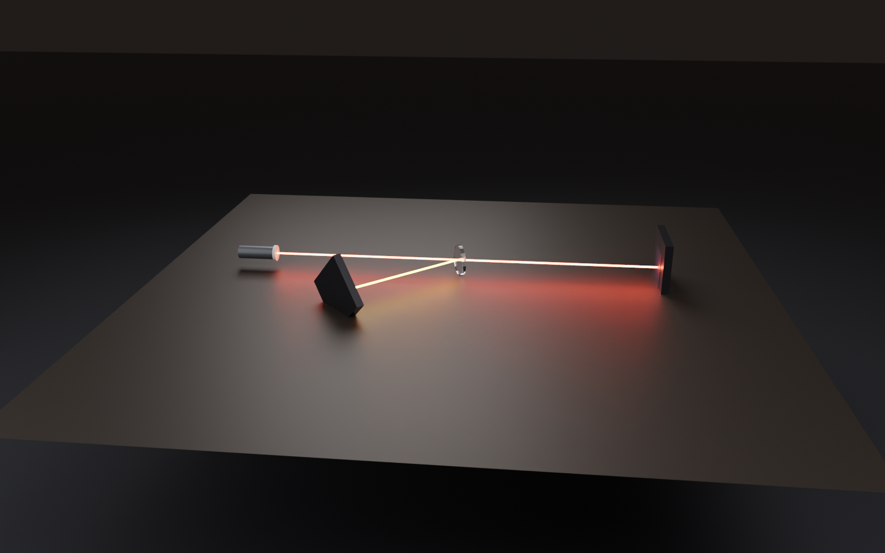 | 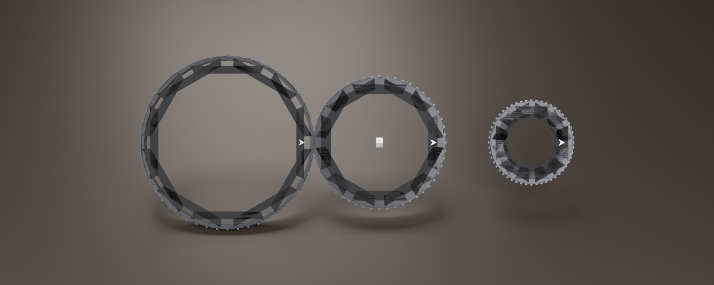 |
| opt-in Fresnel ghosts at transmissive faces; an isolator clears the `back_reflection` flag | a paintable reflectance pickoff + neutral absorber, R + T + A = 1 | a real multi-leaf iris stops down the beam (a data model, byte-identical) |

---

## Methods — physical & digital

Two halves: the **physics** the simulator models, and the **engineering** that keeps it honest.

**Physical methods** (the optics, all in a dependency-free `physics.py`):

- **Geometric chief-ray tracing** through sequential elements — Snell refraction, vectorial Fresnel, multi-bounce splits.
- **Polarization** — Jones vectors/matrices, Stokes / DOP, Malus, exact 3-D Fresnel s/p phase, and a per-pixel DoFP polarization camera.
- **Gaussian beams** — the complex *q*-parameter through ABCD systems: `w(z)`, `R(z)`, Gouy phase, beam quality `M²`, mode-matching.
- **Wavefront sensing** — modal 15-Noll-Zernike *and* pyramid (slope) reads, closed-loop adaptive optics, and dense zonal surface-figure maps (`W = 2·cos²θ·Δdepth`).
- **Wavelength** — Sellmeier dispersion `n(λ)`, soft-edge dichroics (`R(λ) + T(λ) = 1`), interference / colored-glass filters, the grating equation.
- **Interference & phenomena** — coherent recombination + fringe visibility, off-axis-hologram carrier spacing `Λ = λ/(2 sin θ/2)`, nonlinear χ² conversion (SHG / SPDC), acousto-optic Bragg deflection.

**Digital methods** (the engineering that makes it trustworthy):

- **Property-driven & byte-identical** — every behaviour is *element properties × `matrix_world`*; the mesh is cosmetic and the trace is deterministic until you act (the architecture below).
- **Oracle-verified** — every core formula is machine-checked against an external symbolic + numeric oracle (units, identities, limits, known-input → known-answer) before it ships: **verified**, not "dimensionally plausible."
- **A 357-check regression harness** runs headless in Blender on every push (CI-green), and opt-in features stay trace-byte-identical.
- **AI-drivable over MCP** — the agent loop *read → judge → act → re-trace*, advisory corrections you judge (refuse / partial / accept), and five `/optics-*` skills.
- **Reproducible figures** — the analysis figures are composed by `tests/_plot_*.py` from dumped trace data through a shared [figure schema](docs/FIGURE_STYLE.md) (`figstyle`) that **guarantees the colorbar and captions never overlap or clip**, and is re-themeable without touching the layout.

---

## Physics & scope (honest)

<p align="center">
  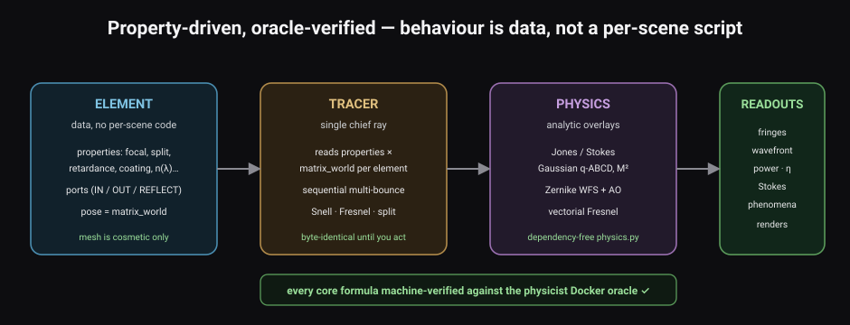
</p>

The **live trace** is a **single-ray (chief-ray) geometric tracer** (`tracer.py`) with **analytic physics
overlays** — Jones/Stokes polarization, Gaussian-beam ABCD propagation, and analytic interference / fringe
models, all in a dependency-free `physics.py`. The live trace itself is **not** a wave-optics solver — it
stays instant and **byte-identical**. On top of it sits an **opt-in, on-demand physical-optics field engine**
(new in v0.12.0) — the real diffraction PSF, sampled-field propagation, turbulence, nonlinear pulses,
Monte-Carlo transport, FDTD orchestration — that you call explicitly and that **never touches the live trace**,
so the byte-identical regression is preserved. It is **not** a lens-design optimizer.

But what it *does* model, it models honestly. The **core formulas below are checked against an
external symbolic + numerical oracle** (the `physicist` verifier: units, symbolic identities, limits,
and known-input → known-answer) — so they are *verified*, not merely "dimensionally plausible." The
broader element-variant catalog is physically modeled but **not each independently oracle-checked** —
see [docs/OPTICAL_ELEMENTS.md](docs/OPTICAL_ELEMENTS.md) for per-element provenance.

| Layer | Models | Validated against |
|-------|--------|-------------------|
| **Polarization** | Jones vectors/matrices: source state, polarizer (Malus), waveplate (HWP/QWP + fast axis), PBS (s/p); Stokes/**DOP**; a **per-pixel DoFP polarization camera** (0/45/90/135° → single-shot S0/S1/S2 + DoLP/AoLP) | Malus cos²θ, QWP→circular, PBS 50/50, DoFP S₀/S₁/S₂ ≡ Stokes |
| **Interference** | coherent recombination (OPL→phase), coherence envelope from linewidth, fringe **visibility**; complementary Mach-Zehnder outputs; **phenomena detection** (interference / off-axis hologram conditions, advisory) | V=1 at zero OPD, energy conservation, carrier Λ=λ/(2 sin θ/2) |
| **Wavelength** | **soft-edge dichroic** routing (logistic R(λ), T=1−R), filters (LP/SP/BP/ND), grating equation `mλ = d·Δsinθ`, **dispersion** n(λ) (Sellmeier) | grating angle, d-line n(587.6)=1.5168, R+T=1 |
| **Gaussian beam** | complex q-parameter through free space + lenses (ABCD), spot size w(z) with beam-quality **M²**, aperture clipping; wavefront curvature R(z) + Gouy phase rendered into the fringes | focal spot λf/πw₀, Gouy→±90°, θ=M²λ/πw₀ |
| **Wavefront / adaptive optics** | modal Zernike wavefront error per beam (Noll j=1..15), aberrator / deformable mirror / wavefront sensor; the WFS read folds in the beam's **own curvature defocus**; closed-loop modal correction; a **pyramid** (slope) read of the same wavefront | Zernike orthonormality + RMS = √(Σcⱼ²), loop RMS 0.56→0, defocus a₄=w²/4√3Rλ, pyramid dZ4/dx=4√3·x |
| **Newton's rings** | a lensed arm vs a flat reference → wavefront-curvature (1/R) ring pattern | dark-ring radius r_m = √(mλR) |
| **Advanced** | **exact vectorial (3-D)** Fresnel at arbitrary mirror tilt (true s/p phase, linear→elliptical), white-light fringe packets, detector **camera model** (shot/read noise, saturation), one-way **isolators**, **Fabry-Pérot** cavities (Airy/finesse/FSR) | Fresnel Brewster/normal, Airy comb |
| **Nonlinear / acousto-optic** | SHG (λ→λ/2), SPDC (λ→2λ degenerate), acousto-optic Bragg deflection | SHG λ/2, SPDC energy, θ = λ·f_a/v_s |
| **Quantum (analytic)** | Hong-Ou-Mandel dip, Bell **CHSH** | R(0)=0, \|S\|=2√2 |
| **Physical-optics field engine** *(opt-in, off-trace — new in v0.12.0)* | real diffraction PSF (`wave_psf`), angular-spectrum free-space propagation + hologram reconstruction (`propagate_field`), Kolmogorov turbulence screens + seeing imaging (`turbulence_screen`/`propagate_turbulent`), split-step **NLSE** solitons (`propagate_pulse`), MCML tissue transport (`monte_carlo_tissue`), FDTD orchestration (`fdtd_derive_property`) | Airy 1.22 λF#, Strehl=exp(−(2πσ)²), w(z), D(r)=6.88(r/r₀)^{5/3}, soliton shape-invariance, R+T+A=1, TMM≡quarter-wave |

Two additions stay deliberately honest about their tier: **`detect_phenomena`** *flags* the conditions a
phenomenon needs (it does not produce a diffractive image), and the **pyramid WFS** reports the wavefront
*gradient* a pyramid integrates — a geometric slope, **not** a diffractive 4-pupil image (the chief-ray
tracer does not propagate the pupil-plane field). Both are labelled Tier-1 in the code and docs.

Run the self-test with a bare interpreter (no Blender needed):

```bash
python3 optical_alignment_sim/physics.py   # -> PHYSICS SELFTEST PASSED
```

**Catalog & meshes.** A built-in, **IP-clean component library** — **our own**, built to **real
market norms**: **38 catalog entries** whose dimensions, specs, and mount conventions are modeled on
industry-standard parts (the kind you'd source from Thorlabs, Edmund, Newport, …), addressable by
SKU, plus **118 documented real-world variants** in
[docs/OPTICAL_ELEMENTS.md](docs/OPTICAL_ELEMENTS.md). **No vendor CAD is bundled** — vendor 3-D
models are the vendors' IP. The library ships only **original metadata** (element type, port
geometry, mount parameters) and **correct generic mesh-free geometry** at true functional
dimensions, so every entry is usable out of the box. Import your own CAD (STL/OBJ natively;
STEP/IGES via FreeCAD) to drop in an exact part.

---

## Install

Requires **Blender 4.2 LTS or newer** (4.2+ / 5.x).

### One-click — recommended, auto-updates

Open the **[install page](https://emircbngl.github.io/blender-optics-simulator/)** and drag the
**“⤓ Drag this into Blender to install”** button onto an open Blender window. Blender installs the
add-on **and** subscribes you to update notifications in one gesture — no URL to type. (Make sure
*Edit ▸ Preferences ▸ System ▸ Network ▸ Allow Online Access* is on.)

Every future release then appears **inside Blender** — a status-bar badge, then *Preferences ▸ Get
Extensions ▸ Install Available Updates*. You never download a zip by hand again.

Then open the **Optics** tab in the 3D viewport sidebar (press `N`).

### From a GitHub zip — updates from inside the add-on

Download **`optical_alignment_sim-<version>.zip`** from the
[Releases](https://github.com/emircbngl/blender-optics-simulator/releases) page and use *Edit ▸
Preferences ▸ Add-ons ▸ Install from Disk…*. *(Or build from source: `blender --command extension build
--source-dir optical_alignment_sim --output-dir .`)*

Blender's own "Install from Disk" copies live in a **local** repository it never auto-syncs — but you
still get updates: the add-on's **Updates** panel (in the Optics sidebar) has an always-visible
**"Up to date · Check"** control. Pressing **Check** registers the project's update channel for you and
pulls the newest version through Blender's native extension system — **no manual re-download, no
re-install.** (Needs *Allow Online Access* on.)

<a name="install--stay-updated"></a>
### Install & stay updated — every path is covered

| How you installed | How you get updates |
|---|---|
| **One-click drag-link** (recommended) | Blender's native auto-update — new releases appear in *Get Extensions ▸ Install Available Updates* |
| **GitHub zip / Install from Disk** | The in-add-on **Updates** panel → **Check** → **Install** → restart (self-subscribes to the channel on first check) |
| **Built from source** | Same in-add-on **Updates** panel, or `git pull` + rebuild |

Either way, the check runs at most **once a day** and only when *Allow Online Access* is enabled;
nothing phones home otherwise.

---

## Quick start

### From the UI

- **Examples ▸** pick *Michelson* (or any of the 26) to spawn a full setup with the live beam overlay.
- **Element** — select an object, *Tag as Optical Element*, *Auto-Detect Ports*; per-type parameters
  appear (source polarization, waveplate angle, lens focal length, …).
- **Mount & Adjustment** — *Apply Mount Preset* (e.g. KM100CP/M), *Set Coarse Pose*, drive the
  tip/tilt knobs.
- **Simulation** — toggle *Live simulation*; the beam updates as you move parts. *Start MCP Bridge*
  to let an external agent drive the scene.
- **Alignment Report** — *Update Report* / *Align* / *Align All*; detectors show measured power,
  polarization, and fringe visibility.
- **Adaptive Optics** — *Run AO Loop* to sense a wavefront and drive a deformable mirror flat.
- **Render** — pick a camera + **Background** preset, then *EEVEE Preview* / *Cycles Final* (toggle
  **Realistic optics** for glass + studio lighting); **Dress Bench** for the full table; **Export SVG
  Schematic** for a publication-ready vector figure.

### Headless / standalone scripts

`examples/` contains builders that run with or without the add-on installed:

```bash
blender --background --python examples/agent_align.py    # the agent-align demo, headless
blender --background --python examples/mach_zehnder.py
```

---

## How this compares

A **layout, alignment, visualization, and agent-control** tool — not a lens-design optimizer or a
wave-optics solver. It sits in a niche the standard tools don't cover:

| | What it does | Optics physics | Photoreal 3-D bench + opto-mech | **AI agent over MCP** |
|---|---|:---:|:---:|:---:|
| **Zemax / OpticStudio, CODE V** | sequential/non-sequential lens design + optimization (MTF, tolerancing) | full ray + diffraction | — | — |
| **POPPY, diffractio, prysm** | physical / Fourier optics (PSFs, wavefront propagation) | full wave-optics | — | — |
| **OptiCore** (Blender add-on) | generates precise optical-element *meshes* (lenses, mirrors) for rendering | element geometry only (no beam trace) | ✓ (meshes) | — |
| **Blender** (alone) | gorgeous renders | none | ✓ | partial (geometry only) |
| **This** | lay out → simulate → auto-align → render a real bench | single-ray + analytic overlays | ✓ | **✓ (full state as JSON)** |

The unfair advantage is the last column. Need a diffraction PSF or a tolerancing run? Reach for
Zemax/POPPY/prysm. Want physically precise lens/mirror *meshes* to render? [OptiCore][opticore] is
excellent at exactly that. This tool is the other half: it doesn't just place accurate geometry — it
runs a **live beam** through it (ray + Gaussian-q + Jones/Stokes polarization), **auto-aligns** the
bench with influence-matrix solvers, flags problems with `diagnose()`, and exposes the whole state so
an **AI agent can drive it over MCP** — the **Blender × optics × MCP** intersection almost nobody
occupies.

[opticore]: https://github.com/CodeFHD/OptiCore

---

## How to cite

If you use **Blender Optics Simulator** in academic work, please cite it. A machine-readable
[`CITATION.cff`](CITATION.cff) is included, so GitHub shows a **"Cite this repository"** button with
ready-to-paste APA / BibTeX.

```bibtex
@software{cobanoglu_blender_optics_simulator,
  author  = {Çobanoğlu, Muhammet Emir},
  title   = {Blender Optics Simulator},
  year    = {2026},
  version = {0.28.0},
  doi     = {10.5281/zenodo.20778997},
  license = {GPL-3.0-or-later},
  url     = {https://github.com/emircbngl/blender-optics-simulator}
}
```

This software is archived on **Zenodo** with a citable DOI:
[**10.5281/zenodo.20778997**](https://doi.org/10.5281/zenodo.20778997) — the *concept* DOI, which always
resolves to the latest version. Each release also mints its own version DOI (see
[`CITATION.cff`](CITATION.cff)).

---

## License & credits

**GPL-3.0-or-later.** See [`LICENSE`](LICENSE). Vendor CAD/meshes are not included and remain the
property of their respective owners; this project ships only original metadata, procedural geometry,
and tooling.

Built in the spirit of Bigweld's maxim from *Robots* (2005) — **"See a need, fill a need."**
